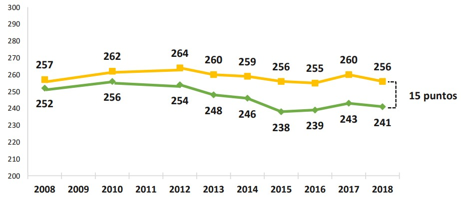

```{r setup, include=FALSE}
knitr::opts_chunk$set(echo = TRUE)
```


Autor: Carlos Budnevich Portales

Profesor guía: Juan Carlos Castillo

                                                           
**Resumen**

La masiva intromisión de agentes privados en la educación a partir de las reformas de 1980 derivó en la configuración de un mercado escolar, teniendo dos grandes consecuencias: Primero, se exacerban las diferencias de rendimiento según nivel socioeconómico; En segundo lugar, en virtud de los mecanismos económicos, sociales y culturales altamente selectivos y discriminatorios utilizados por los establecimientos, se produce un sistema educacional altamente segregado. Los individuos de origen socioeconómico más bajo, los grupos étnicos, y los migrantes, tienden a concentrarse en escuelas públicas, mientras los estudiantes de élite se concentran en colegios particulares pagados, habiendo una alta segmentación cultural, social y económica de la matrícula de los establecimientos. La literatura internacional muestra, por un lado, el efecto negativo que tiene el nivel socioeconómico promedio bajo de las aulas, una alta proporción étnica, y una alta proporción de migrantes, en el rendimiento académico de los alumnos más desaventajados. Por otro lado, la composición de género de las aulas también sería fundamental pues las mujeres obtendrían peores resultados en matemática en aulas mixtas en comparación a los resultados obtenidos cuando están en aulas sólo con mujeres. Pese a lo anterior, habría mecanismos mitigadores de los malos resultados académicos exhibidos por estos individuos. De este modo, mayores niveles de heterogeneidad socioeconómica y cultural podrían favorecer el rendimiento de los estudiantes más pobres, y minorías étnicas/migrantes. La presente investigación tiene como propósito central evaluar la relación que tiene el grado de heterogeneidad de la composición escolar en términos socioeconómicos, étnicos/nacionalidad, y de género con el rendimiento académico de las mujeres, indígenas, individuos de bajo nivel socioeconómico y migrantes de II medio en las pruebas SIMCE 2017 de matemática y lenguaje. Para ello, se estimarán modelos multinivel a partir de los datos que proporciona el Ministerio de Educación de la prueba SIMCE. 

Palabras clave: **desigualdad**, **educación de mercado**, **segregación educativa**, **composición escolar**, **rendimiento académico**.


# Introducción 

La educación es una de las áreas que mayor atención política y social recibe debido a la importancia que reviste en términos del impacto que tiene sobre la fisonomía de las sociedades. Las posibilidades de ascenso social [@palet_desiguales_2017], la reproducción social de la estructura de clases [@bourdieu_herederos_2009;@bourdieu_reproduccion_1998;@hansen_social_1997], y la generación de segmentos socialmente separados o sociedades segregadas [@bellei_estudio_2013; @valenzuela_socioeconomic_2014;@ortiz_escuelas_2015] asociadas a la forma del sistema educativo son sólo algunos elementos de esta área que han sido fruto de extensos debates tanto a nivel internacional como nacional. 

Uno de los principales elementos que ha capturado la atención del fenómeno educativo es de qué forma poder mejorar la calidad del proceso educacional, particularmente en lo que refiere a la transmisión y adquisición de habilidades de los alumnos. En ese sentido, en términos de políticas educacionales, la discusión que subyace a esta investigación es de una importancia fundamental. 
Se ha sostenido, sistemáticamente, que los resultados académicos o la efectividad escolar dependen, exclusivamente, de variables asociadas a la gestión pedagógica, la calidad docente, y los recursos materiales que disponen los establecimientos educacionales. Contraria a esa visión, hay quienes [@ortiz_escuelas_2015; @mizala_bringing_2012; @taut_efecto_2012;@thrupp_school_2002b] plantean la importancia que tiene la composición social de los establecimientos educativos en lo que respecta al rendimiento de los estudiantes y su efecto perjudicial sobre aquellos más desaventajados. Las consecuencias que se derivan de cada una de estas posturas divergen sustancialmente, pues mientras la primera posición nos sugiere que la política educativa debe centrarse en la inyección de recursos económicos y capital para mejorar la calidad educacional, la segunda da cuenta de la relevancia que asume la fisonomía y estructura del sistema educativo, enfatizando en la importancia que tiene la igualdad y equidad [@mizala_bringing_2012]. En efecto, si se logra demostrar que una mayor mixtura o heterogeneidad social tiene un impacto positivo en el rendimiento de los estudiantes históricamente marginados las orientaciones de la política educacional deben ir en la dirección de reformar la estructura del sistema procurando promover una mayor integración social a todo nivel en términos de generar escuelas más heterogéneas. 

Chile resulta ser un interesante caso de estudio en esta materia, en virtud de la novedad comprendida en las reformas que se han implementado en las últimas décadas. Dos de ellas merecen especial atención debido al elevado impacto que han tenido. Primeramente, el paquete de reformas que fue implementado a partir de 1980 por la dictadura civil militar. Estas medidas producen una serie de cambios sustanciales en el funcionamiento y estructura administrativa del sistema escolar. Uno de los más importantes, refiere al nuevo rol que asume el mercado, el cual irrumpe como un proveedor central en la educación secundaria despojando al Estado en cuanto al rol protagónico que había desempeñado. De este modo, proliferan los establecimientos privados que, pese a recibir financiamiento estatal, emplean mecanismos fuertemente segregadores [@oecd_pisa_2016]. Pruebas de admisión arbitraria, selección de los estudiantes según criterios discrecionales (entrevistas familiares, revisión de imágenes de los postulantes, estado civil de los padres, entre otros), segmentación socioeconómica de la matrícula derivado de las mensualidades cobradas, en definitiva, se consolida un esquema educacional edificado a partir de la discriminación social hacia los estudiantes [@bellei_estudio_2013; @bellei_gran_2015; @valenzuela_evolucion_2008; @trevino_segregacion_2014; @bellei_expansion_2007; @garcia-huidobro_desigualdad_2007;@contreras_when_2010].

Basado en el paradigma de mercado, se procuró hacer competir a las escuelas por la captación de los estudiantes a partir del denominado “voucher”, que es una subvención otorgada por el Estado sin distinción (esto es, independiente de si lucra o no y de su dependencia administrativa) por la cantidad de alumnos matriculados en cada escuela y la asistencia efectiva que ellos mostraran. Esto obligaría a los establecimientos a impulsar políticas que mejoraran los logros educacionales para poder captar más alumnos y así poder financiarse y subsistir.

Luego, el segundo gran punto de inflexión de la educación chilena de las últimas décadas, se remite a la recién (2015) aprobada nueva ley de educación pública. Los contenidos de la reforma contemplaron trascendentales cambios que significaron una radical reorientación de los antiguos cimientos y directrices que habían marcado la pauta de la educación chilena desde el conjunto de reformas ejecutadas en 1980. El traspaso de la administración de la educación desde los municipios al aparato estatal (mediados por los servicios locales de educación) y la erradicación de mecanismos selectivos en colegios que reciban algún tipo de financiamiento público revierten, parcialmente, la tendencia mercantil y discriminatoria que se había impregnado en el corazón del sistema educacional. 

Contrario al objetivo declarado por los promotores de la gran reforma educacional de 1980 de mejorar la competitividad en el sistema educacional para incentivar una mejora sistemática en los logros educacionales, lo que se ha producido es una alta estratificación social del rendimiento académico (Informe MINEDUC, 2018). La diferencia de puntaje en matemática entre el quintil más rico y el más pobre en estudiantes de II medio es de 102 puntos para el año 2018, cuando 10 años atrás era de 115, lo cual revela los pocos avances en materia de reducir la brecha de aprendizaje entre individuos de distinto origen socioeconómico.  En consecuencia, hay luces sobre una estrecha relación entre el nivel socioeconómico del estudiante y el rendimiento académico.

Asimismo, como consecuencia del sistema educacional altamente privatizado y selectivo, los resultados académicos que tiene cada estudiante estarían fuertemente vinculado al tipo de establecimiento al que cada uno accede en virtud de motivos socioeconómicos, de género, y culturales. Entonces, el sistema educacional no sólo ha sido ostensiblemente ineficiente, sino que también ha producido altos grados de segregación social entre las escuelas y alta homogeneidad interna [@ortiz_escuelas_2015; @villalobos_composicion_2020]. Incluso, según la prueba PISA, Chile tiene un sistema educativo con los establecimientos educacionales que tienen una menor diversidad socioeconómica, entre los países que pertenecen a la OCDE y los que no pertenecen cuyos datos son comparables [@vazquez_segregacion_2016; @oecd_pisa_2016].

De esta forma, cada estudiante estaría condicionado por las características agregadas que tiene la escuela a la que asiste. Mientras los individuos que son de niveles socioeconómicos más altos tendrían compañeros con características similares, aquellos de niveles socioeconómicos más bajos les ocurriría algo similar [@villalobos_composicion_2020]. Lo mismo ocurriría para grupos sociales subalternos como los indígenas y los migrantes, generando entornos de aprendizaje en el aula vulnerables y condiciones poco propicias para un buen aprendizaje. Aquellos grupos privilegiados tendrían a su favor compañeros también privilegiados promoviendo el aprendizaje y, en la contracara, los grupos subalternos que se rodean de individuos con dificultades de modo que podrían ver empeorado su rendimiento [@bellei_estudio_2013]. Es lo que se conoce en la literatura como “efecto par” o efecto de los compañeros. 

En esta investigación procuraremos dilucidar el efecto que tienen los compañeros en el rendimiento individual, específicamente, el impacto de la diversidad de género, cultural, y socioeconómica de estos. Ha sido extensamente documentada la potencia explicativa que tiene el nivel socioeconómico promedio de los establecimientos, siendo una de las variables que mayor atención ha suscitado en los investigadores en educación [@mizala_bringing_2012; @valenzuela_socioeconomic_2014; @bellei_estudio_2013; @canales_educational_2018]. Sin embargo, el estudio acerca de la diversidad social/cultural/género de aula ha tenido un menor desarrollo académico y resultados algo contradictorios. En lo que respecta al género, no hay consenso acerca de la composición de género más adecuada para un buen rendimiento en matemática de las mujeres. Hay investigaciones que señalan que las mujeres obtienen mucho mejor rendimiento en aulas sin hombres [@paredes_mixed_2018], mientras otras han descartado diferencias de aprendizaje entre escuelas mixtas/no mixtas [@villalobos_composicion_2016].

Sobre la diversidad socioeconómica, si bien se ha mostrado claramente que escuelas más heterogéneas en términos socioeconómicos producen un efecto lineal y positivo en el rendimiento académico [@mizala_bringing_2012; @taut_efecto_2012; @ortiz_escuelas_2015] y también que la heterogeneidad favorece más a estudiantes de menores ingresos, hay ciertos elementos de esta relación sobre los cuales aún no hay claridad. En primer lugar, la forma que asume la relación entre ambas variables y, en segundo lugar, no es claro qué niveles o grados de heterogeneidad son deseables en términos de favorecer el aprendizaje de estudiantes de bajo nivel socioeconómico.

En cuanto a la diversidad cultural (considerando la etnia y nacionalidad de los estudiantes), la evidencia para nuestro país muestra que para las minorías étnicas es perjudicial altos niveles de concentración de población indígena en un mismo establecimiento escolar para efectos del rendimiento académico [@canales_educational_2018]. No obstante, al igual que en el caso de la heterogeneidad socioeconómica no se sabe en qué punto crítico se vuelve negativa la concentración étnica, de modo que no sabemos qué niveles de heterogeneidad cultural son deseables para el rendimiento académico de minorías étnicas y migrantes. 

En suma, la pregunta que se busca responder mediante esta investigación es: ¿En qué medida la heterogeneidad de la composición escolar, en términos socioeconómicos, de género, étnicos, y nacionalidad, influye en los resultados obtenidos por mujeres, indígenas, migrantes, e individuos de bajo nivel socioeconómico en la prueba SIMCE 2017 de matemática y lenguaje?

El texto se divide en cinco secciones: En primer lugar, caracterizamos las desigualdades educativas en Chile, partiendo con una breve revisión histórica de la privatización del sistema educacional, después caracterizamos la desigualdad social en el rendimiento académico, y luego una definición de calidad educativa. En segundo lugar, indagamos en la segregación de la educación chilena y su vínculo con la composición social de los establecimientos. Tercero, se revisó literatura relevante en relación con el efecto que tienen los compañeros en el aprendizaje de los alumnos. Cuarto, se enuncian los objetivos e hipótesis de investigación de acuerdo con la revisión de literatura y la pregunta que orienta la investigación. Por último, se describe la metodología a utilizar.

#Desigualdades educativas

##Privatización del sistema educacional chileno

Los antecedentes de la formalización de un sistema educacional se remontan a inicios del Siglo XIX. En aquellos tiempos, el acceso a la educación formal estaba resguardado, exclusivamente, para los miembros de la élite nacional. La provisión de la educación escolar descansaba casi completamente en congregaciones religiosas e instructores privados, de modo que no existía el desarrollo de una institucionalidad educativa más allá de iniciativas privadas y gremiales [@bellei_nueva_2018].

Recién a mediados de siglo, comienzan a proliferar liceos fiscales con la consiguiente expansión de la educación pública. En consecuencia, el aparato estatal emerge, gradualmente, como un nuevo actor en el escenario educativo, siempre conviviendo con las iniciativas privadas ya mencionadas. Con el paso del tiempo, desde la década de los 50’ en adelante, la educación pública se torna cada vez más mayoritaria, no obstante, enfocada en las capas medias y altas de la sociedad chilena [@bellei_conocer_2010; @nunezprieto_educacion_2015]. De esta forma, el Estado acrecienta su influencia en materia educacional, ampliando la cobertura y participación que este tiene en el sistema escolar, pero aun relegando a ciertas fracciones sociales de la población [@bellei_nueva_2018].

La figura de un Estado promotor de la educación se consolida y acentúa con las reformas introducidas por el gobierno de Frei Montalva. En efecto, @nunez_transformaciones_1984 señala que estas reformas terminan por fraguar un Estado fuertemente centralista y burocrático, proceso que ya se había iniciado décadas atrás con la creación del ministerio de educación el año 1927. De esta manera, el aparato estatal se vuelve crucial en el sistema educativo nacional, concentrando funciones normativas, curriculares, supervisoras, administrativas, y financieras. 

El proceso de consolidación de un Estado Docente y de ampliación masiva del acceso a la educación secundaria se vio interrumpido y radicalmente modificado producto del golpe civil militar perpetrado el año 1973. Desde entonces, se instaura un nuevo régimen político con rasgos autoritarios. En este contexto, la dictadura civil militar impulsó grandes transformaciones en el campo educacional: En primer lugar, generó las condiciones para un abandono del Estado como principal agente de la educación deteriorando significativamente la educación pública; y, en segundo lugar, sustituye al histórico Estado activo o “Docente” por la introducción de mecanismos de mercado y la vigorosa entrada del mundo privado en la provisión de la educación [@bafalluy_modernizacion_1983; @jofre1988sistema; @bellei_gran_2015].

A grandes rasgos, enmarcado en el proceso de socavar la estructura estatal en su misión educacional, se impulsa la gran reforma de municipalización de la educación el año 1980. Esta, introdujo tres cambios fundamentales: En primer término, reestructuró completamente el sistema de financiamiento y, en segunda instancia, redujo considerablemente el rol y las atribuciones del Estado. Desde ahí en más, los establecimientos educacionales reciben financiamiento mediante los denominados “vouchers” que son montos de plata que otorga el Estado a cada establecimiento según la asistencia efectiva de sus alumnos a sus establecimientos. Dicho monto se da independiente si el establecimiento posee o no fines de lucro [@bellei_nueva_2018]. El propósito de este esquema descansaba en la idea de que las escuelas, al conseguir financiamiento exclusivamente mediante estos vouchers, iban a tener que competir por los alumnos de modo que, supuestamente, ello haría que las escuelas mejoraran su servicio educativo en virtud de la necesidad de captar la mayor cantidad de estudiantes posible. 

A su vez, el Estado pasa a ser un mero ente que provee de recursos al sector privado, constriñendo sus funciones a sólo garantizar las condiciones para el buen funcionamiento y operación del mercado educacional [@bellei_nueva_2018]. De este modo, el Ministerio de Educación, que antiguamente era determinante en términos del funcionamiento del sistema escolar, ahora sólo se ocupa de fiscalizar, normar, y supervisar el “mercado educacional”. En este marco, los establecimientos educacionales que administraba el Estado pasan a ser parte de los municipios, en función de la zona geográfica de cada uno. 

En este contexto, en la educación privada (incluyendo a los colegios que reciben subvención estatal), comienzan a operar mecanismos de selección altamente arbitrarios, estableciendo procesos de admisión en los cuales se realizaban ciertas exigencias a las familias, al mismo tiempo que filtraban a los estudiantes según el rendimiento académico exhibido en pruebas aplicadas por los establecimientos [@bellei_nueva_2018].

Posterior a la reforma de 1980, las políticas educacionales de los gobiernos democráticos tuvieron una continuidad en lo que respecta a los ejes principales del sistema educacional. Se promulgaron algunas iniciativas cuyo propósito era corregir algunas deficiencias: Primero, la subvención escolar preferencial, otorgando a los colegios que recibían alumnos más vulnerables una mayor subvención que el promedio, de forma que las escuelas procuraran captar a los estudiantes más pobres de la población. Segundo, se mejoran las condiciones materiales de las instituciones educativas, invirtiendo cuantiosas sumas en infraestructura, libros, laboratorios, bibliotecas, y aumentando la jornada escolar. Tercero, se implementa una reforma al currículo escolar en la educación parvularia, básica, y media.  No obstante, el grueso del sistema educativo escolar chileno mantuvo sus pilares fundamentales intactos.

No es sino hasta el año 2015, en el que se debate arduamente una de las reformas de mayor contenido estructural desde la gran reforma de municipalización de la educación de 1980: La controversial ley de “Nueva educación pública”.

Los principios rectores de esta gran reforma, encuentra su base teórica en los conceptos de inclusión social y encuentro entre estudiantes de distintas culturas, etnias, niveles socioeconómicos, género, nacionalidad o religión. En concordancia con ello, busca erradicar cualquier tipo de mecanismo de admisión arbitraria en establecimientos que reciban financiamiento estatal, conforme a la constitución y los tratados internacionales de derechos humanos [@bellei_gran_2015].

La dimensión logística de la reforma contiene un alto grado de complejidad por la profundidad estructural que posee este proyecto, con varias transformaciones sustantivas del funcionamiento de la educación pública. Los jardines y liceos públicos dejan de ser administrados por los municipios, traspasando su administración a los 70 Servicios locales de Educación Pública encargados de administrar completamente todos los establecimientos públicos a lo largo del territorio nacional. Como complemento a los servicios locales de educación, se crea una orgánica central denominada “Dirección de Educación Pública” cuyo objetivo central es formular las directrices generales del nuevo sistema a nivel nacional [@bellei_nueva_2018].

Con el programa de reformas al sistema educativo chileno, se plantea [@bellei_nueva_2018] que la fisonomía de la educación deja de ser “puramente” mercantil, pasando a ser una especie de sistema mixto, en el cual el mercado tiene cierto margen de operación (principalmente, mediante los colegios particulares pagados) y, simultáneamente, un sistema de educación pública robusto con un fuerte apoyo estatal en términos de financiamiento y regulación.

##Estratificación social del rendimiento académico

La realidad empírica muestra que, pese a los objetivos de quienes impulsaron la gran “modernización” del sistema educacional, el logro académico de los estudiantes no ha exhibido estadísticas particularmente positivas. Tomando los resultados desde una perspectiva temporal de las dos pruebas más importantes que evalúan las habilidades de los estudiantes, sólo en una de ellas hay un aumento sostenido, aunque no de gran magnitud, del puntaje en la prueba SIMCE. En efecto, en la prueba de Matemática, hay una mejora de 14 puntos entre el año 2008 y el año 2018. Mientras en Lenguaje, los resultados académicos son desalentadores, pues hay una disminución en los últimos 10 años de los puntajes obtenidos. 

Gráfico 1: Trayectoria del puntaje SIMCE de Matemática II medio.


Fuente: Extraído del informe MINEDUC 2018 elaborado por la Agencia de Calidad de la Educación

Gráfico 2: Trayectoria del puntaje SIMCE de Lenguaje II medio.


Fuente: Extraído del informe MINEDUC 2018 elaborado por la Agencia de Calidad de la Educación


A su vez, la distribución del rendimiento académico se encuentra fuertemente estratificada en términos sociales. En ese sentido, si evaluamos los resultados a nivel histórico de la prueba SIMCE de matemáticas según nivel socioeconómico podremos advertir que hay diferencias muy pronunciadas entre cada quintil de ingreso. Mientras los alumnos del quintil más rico promedian 330 puntos, aquellos del quintil más pobre tan sólo alcanzan, en promedio, 228 puntos. Esta tendencia ha seguido una trayectoria relativamente estable, pues la brecha que se genera entre cada grupo es parecida tanto para el año 2008 como 2018 (con sólo 13 puntos de diferencia), así como también en los períodos comprendidos entre estos años. 

Gráfico 3: Puntaje SIMCE Matemática II medio por quintil de ingreso


Fuente: Extraído del informe MINEDUC 2018 elaborado por la Agencia de Calidad de la Educación

En la misma línea, el comportamiento que tiene el rendimiento académico no es homogéneo si entramos a examinar el género de los estudiantes. Para el caso de la prueba de lenguaje, las diferencias de puntaje que hay entre hombres y mujeres alcanzan una proporción alta y cambiante en el curso de los años. Así, la brecha de género en el aprendizaje de lenguaje se ha ido acentuando con el paso del tiempo, habiendo 15 puntos de diferencia entre hombres y mujeres en la última rendición del SIMCE, en favor de estas últimas. Es interesante mencionar que la brecha de género constatada depende de manera importante del instrumento de medición que se esté utilizando. En ese sentido, a partir de la prueba PISA es posible observar que la brecha es casi inexistente, no obstante, en otras pruebas como SIMCE y TIMSS, las diferencias de género pueden advertirse con claridad.

Gráfico 4: Brechas de género en prueba SIMCE de Lenguaje II medio



Fuente: Extraído del informe MINEDUC 2018 elaborado por la Agencia de Calidad de la Educación

Gráfico 5: Serie histórica de las brechas de género en prueba PISA de Matemática


Fuente: Extraído de Informe Agencia de la Calidad de la Educación Pisa 2018

Gráfico 6: Serie histórica de las brechas de género en prueba TIMSS de Matemática

 

Fuente: Extraído de informe nacional de Agencia de la Calidad de la Educación TIMSS 2015

##Acerca de la calidad educativa en el contexto de un sistema educativo desigual

El rendimiento académico en pruebas estandarizadas es una de las muchas dimensiones que componen una educación de calidad. Teniendo eso a la vista, el concepto de calidad educativa ha sido objeto de numerosos debates tanto en la literatura como en organismos asociados a la supervisión, administración, y regulación de la educación en Chile.

Asociado al modelo de mercado del sistema educacional chileno está la conceptualización de calidad que hacen algunos economistas inspirados en la tradición neoclásica. Si bien no enuncian explícitamente una definición de calidad educativa, es posible identificar una perspectiva de calidad vinculada a algunos elementos centrales que configuran las teorizaciones de dichos autores. 

En ese sentido, @becker_human_1993 sostiene una mirada acerca de la educación estrechamente vinculada al concepto de capital humano. De esta forma, el proceso educativo no sería más que un mecanismo a través del cual se puede aumentar la productividad de los trabajadores con el propósito de impactar positivamente en los indicadores económicos de los países. Es decir, una buena educación sería aquella que produjera individuos más productivos para el sistema económico imperante, omitiendo cualquier otra dimensión humana del proceso educativo.

De este modo, se concibe la educación como “un proceso de aumento de la productividad del individuo y despojándolo de fundamentos en la sociedad que habían sido parte del debate educacional del siglo XX y en especial de aquellos que dicen relación con procesos colectivos y/o supraindividuales (integración social, valores cívicos, etc.). Así, todo proceso educativo, afirma Becker, para ser válido y deseado por la sociedad, debe generar un aumento de capacidades del individuo en el sistema productivo, particularmente, en el mercado laboral, y su agregación y articulación con otros individuos escolarizados llevará a la riqueza de las naciones” [@alejandrocarrasco_mercado_2016, pp.30].

Esta conceptualización va de la mano con el cambio paradigmático implicado en la gran reforma de municipalización de 1980, la cual materializa una visión economicista sobre la educación, fundamentada en las escuelas Austriaca y de Chicago, derivando en una completa subordinación de la discusión educativa a la tecnocracia neoliberal compuesta por economistas formados al alero de dichas escuelas [@alejandrocarrasco_mercado_2016].

Esta noción de calidad educativa experimenta un importante vuelco con la irrupción de las movilizaciones sociales del año 2006 y 2011. Se logra impugnar la perspectiva hegemónica que subordinaba los procesos y la calidad educativa a la orientación mercantil que había asumido la educación chilena. En su lugar, se promueve con fuerza la idea de una educación comprendida desde su potencial integrativo a nivel social, y como una dimensión fundamental de la vida humana que debe ser garantizada por el Estado de Chile [@mayol_derrumbe_2015].

En la misma dirección, se plantea que la educación debería ser un derecho social consagrado para todos los chilenos sin distinción alguna, cuyo fin sea la promoción activa de la integración social, mediante el reconocimiento al otro diverso (en sus múltiples “formas”) como legítimo, así como también una herramienta igualadora en lo que respecta a su distribución y provisión [@alejandrocarrasco_mercado_2016].

De esta forma, recobra importancia el ideal comunitario que caracterizaba a la educación del siglo XX. Pues el proceso educativo se concibe como un proceso de adquisición de ciudadanía, procurando incentivar la noción de que los individuos forman parte de una misma comunidad política y, por ende, que deben reconocerse como tal. Esta visión contrasta totalmente con aquella mercantil que sólo releva el retorno económico que puede tener la educación [@atria_mala_2012].

Uno de los principales organismos que ha participado en el debate acerca del concepto de calidad de la educación es la Agencia de Calidad de la Educación. Este es un organismo que fue creado el año 2011 con el propósito de orientar y supervisar el sistema educacional chileno en lo relativo a la equidad y calidad de la educación de nuestro país. 

Recogiendo los amplios debates de la literatura y las heterogéneas visiones brindadas por los diferentes actores sociales del mundo educacional, la agencia ha velado por una complejización del constructo de calidad de la educación. Alineado con ese propósito, la agencia señala que: “Se entiende por una educación de calidad un proceso formativo integral que pone en el centro al ser humano en su totalidad, promoviendo un desarrollo consistente e integrado del conjunto de dimensiones, incluyendo la espiritual, la ético-moral, la cognitiva o intelectual, la afectiva, la artística y la de desarrollo físico, entre otras, y que se orienta a proveer oportunidades de desarrollo e integración social al conjunto de los niños y niñas, jóvenes y adultos de manera equitativa e inclusiva, previniendo la discriminación y la segregación de cualquier tipo, garantizando que todas y todos puedan ser ciudadanos autónomos, responsables, proactivos y críticos” (Plan de Aseguramiento de la Calidad Escolar 2016-2019, pp. 16).

Con ese insumo teórico, las políticas públicas disponen de un referente con el cual pueden orientar la evaluación y fiscalización que hacen del sistema educativo. Cabe destacar que la calidad educativa resulta ser un constructo que trasciende los buenos rendimientos en pruebas estandarizadas en las materias tradicionales. Se trata, entonces, de poner el centro en formar personas integrales que sepan convivir armoniosamente en una sociedad diversa (Agencia Calidad de la Educación, 2017). Si bien en la presente investigación nos centraremos en la calidad del proceso educativo asociado a las habilidades cognitivas (medidas a partir de la prueba SIMCE), no perdemos de vista que es sólo una de las muchas dimensiones que configuran el aprendizaje de los alumnos.

Asimismo, es crucial relevar la trascendencia que tiene la inclusión social en una educación de calidad. De este modo, la preocupación no debe residir meramente en formar individuos con aptitudes afectivas, académicas, y cognitivas, sino que también en promover activamente el respeto hacia el otro y el trato igualitario a los individuos independiente de su origen social, cultural, étnico, y de género. De este modo, las escuelas deben centrar su quehacer en hacer de ellas espacios más inclusivos socialmente, combatiendo así la segregación que impera en nuestro sistema educacional. 

#Segregación social del sistema educacional chileno

##Una caracterización cuantitativa de la segregación social

El fenómeno de la segregación social se vincula estrechamente al proceso educativo que vivencian los estudiantes. Un sistema educacional más inclusivo, es decir, menos segregado, es socialmente beneficioso para el conjunto de la sociedad, así como también para los individuos. Cuando los sujetos comparten en la sala de clases con individuos de origen social diverso tiene, entre sus consecuencias positivas, desarrollar una mayor tolerancia hacia sujetos de diversa procedencia social, favorece la eliminación de estereotipos y estigmas, es un estímulo importante a la cohesión social de los países, entre otros beneficios [@valenzuela_evolucion_2008].

Además de tener efectos positivos concretos en muchos indicadores de calidad, una buena educación para todos los individuos independiente de su origen social es deseable puesto que nos acerca al ideario normativo de la igualdad de oportunidades [@vandewerfhorst_changing_2014], fuertemente asentado en las valoraciones morales que hacen los sujetos de las sociedades occidentales. 

Conceptualmente, entenderemos la segregación social como “la desigual distribución que poseen los diversos grupos sociales ya sea entre unidades de organización diferentes, entre zonas geográficas o en una combinación de ambos, tal que dichas diferencias de distribución afectan las probabilidades de interacción entre miembros de los diferentes grupos sociales” [@james_measures_1985, pp.45]. 

En consecuencia, la segregación social de un sistema educacional determinado repercute directamente en el grado de homogeneidad/heterogeneidad de la composición social de los establecimientos escolares. 

Como consecuencia de la privatización del sistema educacional chileno, se producen altos niveles de segregación socioeconómica. Siguiendo los datos obtenidos a partir de la prueba PISA, Chile presenta un nivel de segregación escolar muy elevado comparado con los 57 países que participan de la OCDE [@gonzalez_segregacion_2017]. Concretamente, nuestro país y Tailandia son los dos países con mayor segregación socioeconómica del sistema educativo, tomando como referencia al 30% más pobre y al 30% más rico, alcanzando valores sobre 0,5 en el índice de Duncan (que procederemos a explicar a continuación), cuando la mayoría de los países se ubican en torno a 0,3-0,4. 

En esa línea, se ha estimado que, según el índice de Duncan (medición utilizada para cuantificar el nivel de interacción entre grupos sociales, obedeciendo a la definición conceptual recién señalada), tendríamos una segregación aproximada, para el conjunto del sistema educacional de 0,5, exhibiendo una de las cifras más altas en perspectiva comparada como muestra el gráfico 7 [@murillo_evolucion_2018]. Ahora bien, si efectuamos el análisis de forma parcelada, según el nivel de ingreso de cada porción de la sociedad, encontramos que todas las categorías muestran un grado de segregación significativa, no obstante, quienes se concentran en la parte alta de la distribución del ingreso son los que están más segregados (alrededor de 0,6 en el índice mencionado, donde valores más alto indican un mayor nivel de segregación), esto es, tienen muchas menos posibilidades de relacionarse con individuos que pertenecen a grupos sociales que difieren de ellos. 

Gráfico 7: Evolución de la segregación socioeconómica en el sistema educacional por nivel de ingreso


   
Fuente: Extraído de Murillo et. al (2018): “Evolución de la segregación socioeconómica de las escuelas de América Latina”   	

Con un propósito similar @bellei_estudio_2013 halla que, en perspectiva comparada, nuestro país es el más segregado tanto social como académicamente cuando tomamos como punto de comparación los países que pertenecen a la Organización para la Cooperación y el Desarrollo Económico (En adelante OCDE). Utilizando una metodología diferente de la que evalúa la segregación según el ya mencionado índice de Duncan, busca medir el nivel de homogeneidad/heterogeneidad a partir del nivel socioeconómico y el capital cultural de los estudiantes de un mismo establecimiento educacional (estadísticamente corresponde a la varianza intra-escuela), nuestro país resulta tener el peor nivel de inclusión social. Por el contrario, Finlandia es el país más integrado socialmente con un valor de 90 aproximadamente en el índice estandarizado que tiene por valor máximo el 100, tal como muestra el gráfico 8. En consecuencia, Chile es un país donde los diferentes estratos socioeconómicos y culturales tienen muy poco vínculo entre sí, mientras en Finlandia los diferentes individuos concurren en similar proporción a los establecimientos constituyéndose en espacios sociales heterogéneos que permiten el diálogo y la interacción de todos quienes componen a la sociedad [@bellei_estudio_2013].

Gráfico 8: Índice de inclusión social y académica para países perteneciente a la OCDE


 
Fuente: Extraído de Bellei (2013): “El estudio de la segregación socioeconómica y académica de la educación chilena. Estudios pedagógicos” 

##Relación de la segregación social con la composición de los establecimientos

Siguiendo esta caracterización más general, es posible constatar que el elevado nivel de segregación social del sistema educacional chileno se expresa concretamente en una alta homogeneidad interna de los establecimientos y, también, una alta heterogeneidad entre las escuelas. En ese sentido, @villalobos_composicion_2020 señala que el sistema escolar chileno tendría cuatro grupos de escuelas, agrupadas a partir de un conjunto de atributos sociales identificados por el autor (género, etnia, nacionalidad, necesidades educativas especiales, y nivel socioeconómico). Un grupo de establecimientos concentraría a la élite del país, en colegios particular pagados, un segundo grupo que agruparía a estudiantes vulnerables, un tercer grupo que integraría a las clases medias del país, y un cuarto grupo de establecimientos que tendría un elevado grado de heterogeneidad social en términos socioeconómicos y académicos. 

Asimismo, la porción de establecimientos heterogéneos se explicaría, fundamentalmente, por razones académicas, de género, y de ingresos. Mientras, la cantidad de colegios heterogéneos en lo que respecta a atributos como etnia, nacionalidad, y necesidades especiales es muy baja. En efecto, es poco probable que los estudiantes de diversas culturas y etnias se encuentren en un mismo establecimiento en la medida que están homogéneamente distribuidos en el sistema educacional. Por el contrario, estudiantes de diferentes géneros, rendimiento e ingreso están más mezclados entre sí, produciendo una mayor mixtura social [@villalobos_composicion_2020]. 
	
Analizando en detalle los establecimientos educacionales chilenos, podemos observar que un 85,2% es heterogéneo en términos del sexo de los estudiantes, un 12,29% es heterogéneo en términos étnicos, y tan sólo un 5,1% lo es en lo que refiere a la nacionalidad de los estudiantes que componen los establecimientos [@villalobos_composicion_2020]. Es interesante destacar que son las cifras más actualizadas acerca de la composición escolar de los colegios en Chile.

En consecuencia, el sistema escolar chileno estaría altamente fragmentado en la medida que los diferentes grupos sociales tienen poca interacción entre sí (con algunas excepciones), obstaculizando el desarrollo de una mayor cohesión social y el desarrollo de valores asociados a la aceptación de la diversidad social [@villalobos_composicion_2020].

Con un propósito similar, se ha evidenciado [@ortiz_escuelas_2015] que el sistema educacional chileno estaría compuesto, a grandes rasgos, por tres tipos de establecimientos. Habría establecimientos compuestos mayoritariamente por estudiantes aventajados (34,4%), establecimientos mixtos o inclusivos socialmente (22,8%), y colegios que concentran predominantemente estudiantes vulnerables o desaventajados (42,8%).

El modo a partir del cual se genera la tipología de establecimientos resulta tener importantes arbitrariedades a ser corregidas. La metodología usada para determinar lo anterior se basa en comparar el nivel socioeconómico promedio de los establecimientos, con la media nacional, realizando una prueba T de dos colas para decidir si cada uno es superior o inferior a dicha media y, conforme a ello, determinar si es de estudiantes aventajados (nivel socioeconómico sobre la media), mixto socialmente (cercano a la media socioeconómica nacional) y compuesto por estudiantes desaventajados (nivel socioeconómico del establecimiento bajo la media). 

En términos étnicos, @trevino_educacion_2017 muestra de qué forma se generan los patrones de segregación de la población indígena en Chile. Según este, la segregación de este grupo en particular se explicaría por razones geográficas, esto es, a raíz de la forma en que se asienta la población, donde los sectores indígenas tienden a concentrarse en zonas rurales. De esta forma, habría una diferencia importante respecto a otras formas de segregación social que venían dadas, principalmente, por políticas explícitas de los establecimientos educacionales. Por lo tanto, se concentran de forma importante en las zonas rurales, lugares en los cuales encontraríamos una mayor homogeneidad étnica de los establecimientos, mientras en zonas urbanas dicha homogeneidad interna sería menos acentuada. 

##Factores asociados a la segregación social

Respecto a las causas que explican esta elevada magnitud de segregación la evidencia ha demostrado que uno de los principales factores que influiría sería la asimetría de información existente entre los apoderados que eligen las escuelas, mediado por el capital económico y cultural que disponen [@elacqua_impact_2012]. En efecto, las familias de bajos ingresos elegirían los colegios a partir de criterios no educacionales, a saber, según cercanía del hogar fundamentalmente, mientras las familias con mayor capital económico enfocarían su decisión en la calidad académica de las escuelas [@valenzuela_socioeconomic_2014]. Desde una perspectiva cualitativa [@hernandez_eleccion_2015], muestran de qué modo la clase media y baja del país producen dinámicas de exclusión social. Los sectores medios fundamentan su elección de escuela según la búsqueda de distinción social, mientras los individuos de familias más pobres se auto excluyen, reforzando la segregación socioeconómica de la matrícula. En virtud de lo anterior, se generarían escuelas con altos niveles de segregación, de manera que las familias pobres quedan relegadas a escuelas de mala calidad y las familias de altos ingresos a las mejores escuelas del país.

La segregación residencial existente en las grandes ciudades del país explicaría una parte importante de la magnitud de la segregación socioeconómica del sistema educacional [@flores_consecuencias_2006; @arteaga_school_2014]. En efecto, las estimaciones cifran en alrededor de un 8-13% de varianza de la segregación socioeconómica explicada por la segregación residencial, particularmente para el caso de Santiago.

Si bien la estructuración urbana de las ciudades se relaciona con la segregación, ciertos autores [@bonal_understanding_2019b], mediante entrevistas a apoderados de diversos estratos socioeconómicos, han consignado que los mecanismos de mayor impacto estarían mediados por las dinámicas de mercado del sistema educacional. De este modo, la demanda de los apoderados por educación para sus hijos tendría orientaciones fuertemente influenciadas por la composición social de los establecimientos, buscando espacios con alta homogeneidad interna. En consecuencia, la clase alta busca establecimientos de composición sociocultural elitaria, los sectores medios evitan la educación pública y gratuita para no “mezclarse” con familias de bajos ingresos y, estos últimos, aun cuando una parte importante comparte ese criterio, muchos de ellos decidirán el colegio de sus hijos según cercanía geográfica.

A su vez, la fisionomía del sistema educativo, edificado a partir de mecanismos de selectividad, financiamiento compartido, y escuelas subvencionadas por el Estado respondería a dinámicas de mercado. De esta manera, se incentivaría a los colegios a elegir y seleccionar estudiantes de élite y, en el caso de los colegios con fines de lucro, segmentar también al interior de los colegios de forma tal que los mejores estudiantes estén conformes [@elacqua_impact_2012; @bellei_expansion_2007; @garcia-huidobro_desigualdad_2007; @valenzuela_evolucion_2008; @contreras_when_2010].

En la misma dirección, se ha aducido que el factor más relevante que incide en que un colegio agrupe o no a sus estudiantes tiene relación con el nivel de heterogeneidad socioeconómica del establecimiento más que la diversidad académica existente [@trevino_segregacion_2014]. En coherencia con lo anterior, aquellos colegios más heterogéneos socialmente realizan con mayor frecuencia prácticas de agrupamiento que los que tienen una composición social más homogénea.

Por otra parte, @bellei_estudio_2013 ha señalado que la segregación socioeconómica de las escuelas chilenas se vincularía positivamente a cuatro factores. Primero, la elevada segregación residencial que exhibe el país. Segundo, la magnitud de la presencia de la educación privada no subvencionada en la comuna. Tercero, la relevancia de los establecimientos particulares subvencionados. Por último, la relevancia del financiamiento compartido en la comuna. 

En síntesis, el sistema escolar chileno está dividido en segmentos sociales nítidos, como consecuencia de una serie de políticas educacionales que subyacen al sistema mismo. La combinación de procesos de admisión selectivos, la elección de los padres, el copago, y la segregación residencial serían elementos explicativos de la segregación escolar. En virtud de estos mecanismos, los colegios públicos tenderían a concentrar a la población socialmente más desaventajada, mientras la clase media-baja y clase media asistiría a escuelas particulares subvencionadas [@garcia-huidobro_desigualdad_2007]. 

#Efecto(s) de la composición escolar en el rendimiento académico 

Habría dos mecanismos centrales mediante los cuales operaría la segregación social para producir efectos en los logros educacionales [@bellei_estudio_2013]: por un lado, a partir de la noción de capital social y, por otro lado, la teoría del efecto de los compañeros, objeto de interés en la presente investigación. De este modo, las inequidades en los resultados educacionales podrían estar asociadas a las consecuencias derivadas de la composición de los establecimientos, lugar en el cual los integrantes podrían tener un impacto beneficioso o negativo en los compañeros con los que comparten el aula escolar.

El modo en que operaría el impacto positivo de una mayor diversidad étnica, social, económica y de género en el rendimiento académico serían los siguientes [@dronkers_positive_2013a]: (1) en escuelas más diversas aquellos estudiantes de un origen privilegiado tenderían a colaborar con aquellos que tienen mayores problemáticas o bien siendo una especie de ejemplo para estos últimos; (2) los estudiantes tendrían mayores posibilidades de enfrentarse a un curriculum desafiante y que promueva activamente habilidades de todo tipo, pues los profesores suelen transmitir dichas enseñanzas en contextos en los cuales están los mejores estudiantes o de origen privilegiado; (3) los estudiantes más capaces aprenderían más debido al proceso de enseñanza que ellos practican con los compañeros que requieren que les expliquen las diferentes materias.

No obstante, también es posible que la diversidad del aula tenga efectos inhibitorios de un buen rendimiento académico, siendo preferible una mayor homogeneidad interna. Tres mecanismos se han descrito respecto a este [@dronkers_positive_2013a]: (1) un cuerpo estudiantil más homogéneo incrementa las posibilidades de especialización de los profesores gracias a esa homogeneidad, propendiendo a una mayor efectividad de la escuela; (2) En aulas más homogéneas menos tiempo requiere ser gastado en generar puentes entre los estudiantes de diverso origen cultural y social, permitiendo destinar ese tiempo a mejorar la enseñanza y el aprendizaje de los estudiantes; (3) La confianza entre profesores, apoderados, y estudiantes, en contextos de un cuerpo estudiantil más homogéneo, es considerablemente mayor propiciando un mayor involucramiento de cada actor y, por ende, aumentando la efectividad de las escuelas en términos del aprendizaje resultante de los alumnos.  

##Efecto de composición socioeconómica
 	
Antes de indagar en la literatura sobre el tema, es necesario distinguir dos conceptos que con frecuencia aparecen en la literatura acerca de composición escolar o efecto par de los compañeros. Por un lado, está el concepto de composición y, por otro, el de heterogeneidad. Mientras el primero hace referencia a un promedio o proporción de un atributo determinado (por ejemplo, el nivel socioeconómico promedio de un aula), el segundo alude a la dispersión de alguna característica social definida [@dronkers_positive_2013a].

La primera aproximación empírica al fenómeno de la composición escolar referida al nivel socioeconómico data de varias décadas [@coleman_equality_1965], quien logró distinguir, por un lado, la importante influencia que tienen ciertas características individuales (en inglés, el background), principalmente, el origen socioeconómico de los individuos de, por otro, el efecto que tiene la agregación de esta (y otras) características individuales en el contexto de un establecimiento o sala de clases. De ahí el término de efecto de composición, estrechamente ligado al nivel socioeconómico promedio de una sala de clases o establecimiento escolar, según ciertas variables tradicionales (libros en el hogar, ingreso de los padres, grado educacional alcanzado por progenitores, etc.).

La discusión acerca de la naturaleza del efecto de composición o mixtura social reviste de interés mundial. Han sido muchos los países en los cuales se ha indagado el tópico de composición escolar y rendimiento académico. Por cierto, es un asunto aún no resuelto, pero sí con algunos consensos mínimos.  @thrupp_school_2002b sostienen que después de décadas de investigación acerca de los efectos de composición o mixtura social de las escuelas, el consenso acerca de la naturaleza y tamaño de estos efectos es notablemente poco, una conclusión también evidenciada por muchos otros autores [@hoxby_peer_2000; @angrist_does_2004; @hoxby_taking_2005].  

En Nueva Zelanda, país donde hay un sistema educacional con un nivel de estratificación y segregación social relativamente bajo, la varianza del puntaje entre escuelas es bastante baja. Sólo un 5-9% de la varianza del rendimiento de los estudiantes está contenida entre las escuelas. Sobre ella, tanto la composición cultural (es decir, proporción de individuos de origen maorí, asiático, y de islas pacificas) como la composición socioeconómica medida a partir del nivel socioeconómico promedio del establecimiento tenían casi nula capacidad explicativa de la varianza entre establecimientos en el puntaje en matemática y ciencias, alcanzando alrededor de un 1-2% [@nash_progress_1997]. Los autores ponen en duda la hipótesis de la capacidad explicativa que tendrían variables composicionales económicas y culturales en relación con las puntuaciones que obtienen los estudiantes en pruebas estandarizadas.  

Algo diferente es posible de advertir en la literatura internacional acerca del sistema educacional belga. Según @opdenakker_relationship_2001, la influencia de la composición socioeconómica difiere sustancialmente en función del estrato en específico que se esté examinando. En particular, dentro de cada grupo socioeconómico, los estudiantes de mayor habilidad son más sensibles al cambio de composición socioeconómica del aula que aquellos de baja habilidad, pues el efecto positivo que tendría un aula de alto nivel socioeconómico promedio para estudiantes de alta habilidad, pero de bajo nivel socioeconómico (individual) sería muy grande, generando, de este modo, un impacto diferenciado de la composición mediado por la habilidad y el nivel socioeconómico de los individuos.

En el Reino Unido, uno de los estudios más conocidos en materia de composición escolar, advierte que, aun cuando encuentran un impacto sustantivo del nivel socioeconómico promedio del establecimiento en el rendimiento individual, bien podría ser que ciertos factores no observables estén incidiendo y explicando esa porción de varianza. El autoconcepto que tienen los estudiantes de sí mismos, el capital social, la motivación, el involucramiento de los padres en el proceso educativo del colegio, todos ellos, elementos que influyen en el proceso de aprendizaje pero que no correlacionan altamente con el nivel socioeconómico, razón por la cual podría estar confundiéndose con el efecto de composición socioeconómica [@nash_school_2003].

En este mismo país, otro estudio sobre el efecto de composición del nivel socioeconómico en el rendimiento académico encontró un vínculo fuerte entre ambos. La varianza de los puntajes entre escuelas se encontraba explicado en un 25% por la configuración de clase de los establecimientos escolares. No obstante, al momento de incorporar variables asociadas al rendimiento previo y a las habilidades de los estudiantes, el efecto de composición socioeconómica se cancelaba casi completamente. De este modo, resulta trascendental integrar para cualquier análisis acerca del efecto de los compañeros variables que capturen las habilidades de quienes componen el aula de clases [@gray_estimating_1990]. 

En la literatura sobre este país, también se ha indicado que los factores individuales tienen mucho mayor peso explicativo que aquellos composicionales a nivel escuela. La única materia que se ve afectada por la composición socioeconómica y étnica es el aprendizaje del lenguaje, lo cual probablemente, según los autores, estaría ligado a las escuelas donde hay una alta concentración de migrantes con bajo nivel socioeconómico. Además, según los resultados observados pareciera ser que en el nivel más bajo y más alto de la pirámide socioeconómica se darían, principalmente, los efectos de composición. De este modo, en las capas medias el nivel socioeconómico no sería tan relevante para efectos de predecir el rendimiento académico [@sammons_forging_1997].

Una serie de advertencias metodológicas sugiere el artículo de @vanewijk_effect_2009, quienes sistematizan una fracción considerable de los estudios realizados sobre el efecto del nivel socioeconómico de los compañeros. Según ellos, para obtener estimaciones más precisas de la verdadera magnitud del impacto que tiene el nivel socioeconómico en el rendimiento académico es necesario tener algunas precauciones: Primero, medir de manera íntegra el nivel socioeconómico, pues cuando se construye la variable con pocos indicadores (por ejemplo, sólo considerando la cantidad de libros en el hogar y el nivel educacional de los padres) hay una subestimación significativa del efecto de esta variable; Segundo, controlar en los modelos de regresión por el rendimiento previo de los alumnos, para no sobreestimar el impacto del nivel socioeconómico; Por último, incluir una alta cantidad de covariables para prever la posibilidad de endogeneidad en el modelo.

A nivel nacional, se ha evidenciado que la segregación socioeconómica tiene efectos negativos para los resultados académicos de los estudiantes concentrados en escuelas de bajo NSE, y positivas para aquellos reunidos en escuelas de alto NSE, hecho ampliamente descrito por la literatura y confirmado también para el caso de chile [@valenzuela_evolucion_2008; @mizala_bringing_2012].

En cuanto al efecto que tiene la heterogeneidad social o dispersión según nivel socioeconómico el estudio de @taut_efecto_2012 documenta que esta tiene un efecto positivo sobre el rendimiento de los estudiantes. Incluso, muestran que aquellas escuelas más diversas socialmente logran mitigar el impacto negativo que tiene los bajos niveles de ingreso en el rendimiento de los alumnos. Por otra parte, los estudiantes de más alto nivel socioeconómico se ven perjudicados, levemente, cuando estudian en establecimientos heterogéneos, no obstante, la pérdida que muestran es menor a la ganancia obtenida por los alumnos más desfavorecidos.

Gráficamente, es posible advertir las diferencias en puntaje SIMCE de individuos de un mismo ingreso económico, pero que asisten a escuelas que difieren en el grado de heterogeneidad social. Hasta alcanzar un nivel de ingreso muy alto, es evidente el impacto positivo que tiene pertenecer a un curso heterogéneo en términos del rendimiento en la prueba SIMCE. De este modo, sólo individuos que perciben ingresos muy altos se ven perjudicados por estar en un colegio heterogéneo versus uno homogéneo. 

No obstante, es fundamental advertir que la distinción entre un curso homogéneo y heterogéneo en términos socioeconómicos que realizan los autores resulta ser poco precisa en la medida que dicotomiza la heterogeneidad aun cuando sabemos que esta tiene niveles, pues no se trata, entonces, de que haya cursos “homogéneos” y cursos “heterogéneos” sino niveles determinados de esta variable. Otro elemento interesante de relevar es que la relación analizada supone una linealidad entre ambas variables, asunto acerca del cual no hay claridad. Bien podría haber rendimientos crecientes o decrecientes de la heterogeneidad social como mediador. Por ejemplo, podría ocurrir que a medida que un individuo provenga de una familia de mayores ingresos, el efecto positivo o mitigador de estar en un aula heterogénea se vaya haciendo más pequeño. Son elementos que exploramos en esta investigación. 

Gráfico 9: La heterogeneidad social de las escuelas como moderador del puntaje SIMCE


 
Fuente: Extraído de Taut & Escobar (2012): “El efecto de las características de los pares en el aprendizaje de estudiantes chilenos”

Por último, @ortiz_escuelas_2015 mediante un análisis residual de regresión compara los puntajes de individuos con un mismo background socioeconómico pero que se encuentran en diferentes colegios según si el colegio es homogéneo o heterogéneo socialmente. De este modo, el autor observa que las pérdidas en términos de puntaje debido a la asistencia a uno u otro tipo de establecimiento tendría una magnitud significativa. Según los hallazgos encontrados, los estudiantes de los dos primeros quintiles (es decir, el 40% más pobre) obtendrían entre 40 y 57 puntos más en la prueba SIMCE cuando se encuentran en una escuela de alumnos aventajados socialmente en comparación a lo que obtienen cuando estudian en un colegio de estudiantes desfavorecidos. Entonces, la inclusión social tendría un impacto positivo en los estudiantes más pobres sugiriendo la necesidad de implementar políticas educativas que promuevan la igualdad y equidad en el sistema escolar.

##Efecto de composición de género
 
Las diferencias de rendimiento según el género son de suma relevancia. Uno de los principales factores que ha sido aducido como predictor de las diferencias salariales entre hombres y mujeres es la brecha existente que tienen en el puntaje de matemática [@koedel_math_2012].

Uno de los estudios que reviste de mayor robustez en los estudios educacionales de género concluye que la brecha en matemática se logra reducir a la mitad cuando, en un mismo establecimiento educacional, las mujeres se encuentran separadas de los hombres [@paredes_mixed_2018]. La literatura ha mencionado que esto podría deberse a que se refuerzan los estereotipos y prejuicios de género cuando ambos géneros comparten la sala de clases [@bertrand_new_2011].

En la misma línea que @paredes_mixed_2018, un estudio efectuado en el sistema educacional belga tiene hallazgos relativamente similares. Los investigadores se centran en el efecto que tienen aulas/colegios en las que hay un sólo género y aulas compartidas en el rendimiento que tienen hombres y mujeres en matemática y lenguaje [@vandegaer_effects_2004]. Para los hombres, la composición de género de la clase tiene más impacto que la composición de género del colegio, mientras que para las mujeres ocurre al revés. En consecuencia, los hombres incrementan su rendimiento en lenguaje (y no en matemáticas) en aulas mixtas y a las mujeres, les va mejor en matemática (pero no en lenguaje) en colegios de un sólo género que en colegios mixtos.

@dumay_does_2008, también para el caso belga, obtienen resultados relativamente similares. La mixtura por género no tiene un efecto positivo en el aprendizaje en matemática para los hombres, pero sí en sus resultados en lenguaje. Al mismo tiempo, los colegios mixtos perjudican el aprendizaje de matemática de las mujeres quienes obtienen peores resultados en este tipo de establecimientos.

Un estudio para Estados Unidos realizado en la zona de Texas encuentra que una mayor heterogeneidad de género en términos de mayor proporción de mujeres en el aula produce un efecto positivo en el rendimiento de matemática de los hombres, sin afectar de modo significativo el resultado obtenido por las mujeres de la misma sala de clases [@hoxby_peer_2000].

Evidencia algo contradictoria encuentran otros autores que han indagado en tópicos de género. Según @villalobos_composicion_2016 la composición de género no desempeña un papel primordial en las dos variables recién mencionadas. De esta forma “la educación exclusiva para un solo género en Chile no genera mejores resultados académicos ni tiene efectos claros en el ambiente social escolar, dando así cuenta de la necesidad de incorporar la variable de género como un componente fundamental de la inclusión educativa” [@villalobos_composicion_2016, pp.10].

Similar a lo hallado por Villalobos, una serie de estudios internacionales han encontrado resultados afines. A partir de @bone_girls_1983, en su estudio acerca de la diferencia en términos de rendimiento académico de los establecimientos educacionales de los colegios de un solo género para alumnos británicos, identifica que las diferencias son mínimas una vez que se controla por ciertas variables, especialmente, aquellas asociadas a los procesos de admisión.

En Irlanda, se respalda la hipótesis anterior, en virtud de los hallazgos obtenidos por @hannan_coeducation_1996. No hay diferencias significativas en el rendimiento académico cuando comparamos colegios mixtos con colegios no mixtos. Esta discusión reviste de una importancia trascendental en Irlanda en la medida que alrededor de un tercio de los establecimientos se componen de alumnos de un solo género. 

Con el espíritu de sistematizar los hallazgos vinculados a las diferencias de rendimientos entre colegios mixtos y no mixtos @smyth_singlesex_2010 subraya que, de 39 estudios revisados sobre el tópico, 23 de ellos encontraban un efecto casi nulo o insignificante de la composición de género mixta, en 15 de ellos había resultados favorables a una composición de un solo género, y tan sólo uno del total de los estudios tenía resultados positivos para establecimientos mixtos. 

En el mismo campo de estudio, @taut_efecto_2012 encuentran que a las mujeres les va peor comparativamente que a los hombres en matemática y a estos últimos mejor en lenguaje cuando se encuentran en colegios mixtos. A su vez, otro resultado interesante a destacar es que una mayor proporción de mujeres en la sala de clases se asocia con un mayor rendimiento en matemática de los hombres, no obstante, siguen exhibiendo peores métricas que los hombres (en matemática).

Consistente con los resultados encontrados por Taut y Escobar, @radovicsendra_diferencias_2017 prueba que las diferencias de rendimiento en matemática entre niñas y niños son persistentes en el tiempo según la prueba SIMCE, pues tanto los alumnos de cuarto como de octavo básico muestran diferencias significativas. No obstante, el género del o la estudiante sólo logra explicar un 1% de la varianza de los resultados. Asimismo, las diferencias de género sólo alcanzan, como máximo, un 20% de una desviación estándar. Por último, un resultado novedoso que exhibe el estudio es la interacción significativa entre el género y el nivel socioeconómico de los estudiantes. En ese sentido, las diferencias de género en matemática van decreciendo a medida que los individuos tienen un mayor nivel socioeconómico.
	
##Efecto de composición migrante y étnica

La literatura internacional muestra que los estudiantes que sufren de mayor segregación étnica y racial tienen bajos rendimientos en tareas de tipo intelectual, baja motivación y bajos niveles de formación cívica [@mcewan_can_2008].

La investigación en composición étnica y migrante proviene, fundamentalmente, de Europa. La evidencia nos señala que hay un consenso establecido acerca de los efectos positivos que tiene para las minorías étnicas el pertenecer a escuelas con mayor mixtura pero evidencia más contradictoria con respecto al eventual efecto negativo en el desempeño logrado por las minorías étnicas cuando se encuentran en establecimientos con bajo nivel de diversidad étnica-cultural  [@driessen_ethnicity_2001; @dronkers_school_2007; @szulkin_ethnic_2007; @vanewijk_effect_2009; @vanhoutte_school_2010; @agirdag_why_2012).

El caso estadounidense es ilustrativo al respecto. Aun cuando se han implementado elaboradas políticas de inclusión étnica y migrante en términos de propender hacia una mayor mixtura social, la evidencia empírica acumulada para este país ha logrado demostrar que las diferencias en aprendizaje entre estudiantes migrantes y no migrantes se logran reducir de forma más pronunciada cuando los migrantes se encuentran en establecimientos homogéneos, esto es, con sujetos del mismo origen étnico (es importante aclarar que, en la literatura internacional, dentro de un mismo grupo étnico se consideran varios países. Por ejemplo, el grupo étnico o racial “asiático” incluye países como corea del sur y japón) [@merry_equality_2012].  

Uno de los programas de inclusión social más importantes que se han hecho en EEUU, buscando equilibrar cuantitativamente una composición cultural mixta, encontró resultados interesantes. El programa, denominado METCO, realizado en la ciudad de Boston de Estados Unidos, consistía en transferir estudiantes de colegios con una concentración de alumnos no blancos mayor a 50% a establecimientos con una proporción de estudiantes no blancos menor a 30%. Los resultados de la investigación señalan [@angrist_does_2004], contrario a la mayoría de la evidencia en la materia, que un aumento de las minorías étnicas/culturales en la sala de clases no produce una merma en el rendimiento de la mayoría de los estudiantes. Además, de los efectos observados, el único que pareciera ser relevante, aunque de baja magnitud, sería el impacto negativo de la composición racial en la población negra que ya se encontraba en los establecimientos en los cuales se produjo la llegada de estudiantes del programa METCO (Esto es, estudiantes no-blancos que se hallaban en colegios con alta concentración de pares similares).

En Inglaterra, se llevó a cabo un estudio [@smyth_singlesex_2010] en 18 escuelas con una composición multiétnica cada una, testeando la hipótesis del efecto que poseía la mixtura cultural. La investigación constata que tanto la puntuación obtenida en matemática como la obtenida en lenguaje no se ve afectada por la composición étnica pero sí por el rendimiento previo que tenían los alumnos y también por la proporción de estudiantes de alto logro en la sala de clases.  

En Suecia se efectuó un estudio que documenta el impacto negativo que tiene la alta concentración de estudiantes migrantes en las escuelas en el rendimiento tanto de ellos mismos como de estudiantes nativos. Logran demostrar que cuando hay una concentración o densidad étnica mayor a 40% en la sala de clases, es decir, una proporción de estudiantes migrantes que supere ese límite genera fuertes efectos negativos en las notas que obtienen los estudiantes del establecimiento. De este modo, se sugiere que políticas educativas que contrarresten la segregación generaría impactos positivos tanto en términos de eficiencia como de reducción de la brecha educacional entre los estudiantes [@szulkin_ethnic_2007].

@harker_effects_2004, en su estudio acerca del sistema educacional neozelandés constatan que la varianza que hay en el puntaje de los individuos entre escuelas se explica casi exclusivamente por el nivel socioeconómico promedio de los establecimientos educacionales. El rendimiento previo de los estudiantes y el grado de concentración étnica es irrelevante en términos estadísticos para efectos de capturar la varianza de puntaje entre las escuelas de Nueva Zelandia. Es interesante subrayar que encuentran un impacto similar para las tres pruebas tradicionales aplicadas, a saber, lenguaje, matemática, y ciencias.  

Con una lógica similar, un estudio acerca del sistema educacional alemán [@vanderslik_ethnic_2006] integra en su medición del efecto composición el nivel socioeconómico promedio del aula y la proporción de estudiantes de otras etnias. Los resultados indican que los estudiantes que están en salas de clases con una alta proporción de estudiantes de otras etnias obtienen peores resultados en las pruebas de lenguaje que aquellos estudiantes que están en aulas con baja proporción de estudiantes de diverso origen étnico. Lo interesante del estudio es que al momento de perfeccionar la medición del estatus socioeconómico promedio (añadiendo variables como si la madre está empleada y la variación de los ingresos del padre en el último tiempo), el impacto de la composición étnica deja de ser significativo. 

Indagando con mayor precisión en el efecto de la presencia de inmigrantes en la sala de clases, @contini_immigrant_2013 prueba que una mayor concentración de migrantes tiene un efecto negativo pero diferenciado en el rendimiento académico de los alumnos. De este modo, los migrantes se ven más perjudicados que los nativos por la presencia de migrantes y, entre los nativos, aquellos de nivel socioeconómico más bajo experimentan una mayor baja en su rendimiento que el resto. Todos los efectos negativos encontrados tienen una magnitud baja, razón por la cual las preocupaciones acerca de una eventual merma significativa en las puntuaciones académicas de los italianos, producto de la oleada de inmigrantes, carece de fundamentos empíricos.

Tomando como referencia el sistema educacional de 17 países europeos, @dronkers_positive_2013a, someten a contraste empírico la influencia que tiene la diversidad cultural (incluyendo la etnia y el origen migrante), en el rendimiento académico de estudiantes nativos como de origen migrante, encontrando resultados ostensiblemente ambivalentes. Por un lado, aseveran que una mayor diversidad étnica de la sala de clases produce una merma considerable del puntaje obtenido en habilidades idiomáticas de estudiantes con origen migrante. Mientras, para los estudiantes nativos, el efecto negativo de la diversidad étnica sólo ocurre en aquellos países con sistemas educacionales altamente estratificados en términos sociales. 

Por otro lado, la presencia de ciertos grupos étnicos generaría efectos positivos en el aprendizaje del conjunto diverso que compone la sala de clases. Concretamente, la presencia de estudiantes asiáticos (no islámicos) aumentaría el puntaje obtenido en pruebas de idioma de individuos nativos, inmigrantes no asiáticos, y también en los mismos migrantes asiáticos no islámicos. El efecto más fuerte de la presencia de alumnos asiáticos sería para los mismos alumnos asiáticos, aumentando en 16 puntos por cada 10% adicional de estudiantes que provengan de esa región. Por su parte, para inmigrantes no asiáticos y alumnos nativos el grado de influencia sería de 7 y 5 puntos respectivamente cada 10% adicional de asiáticos no islámicos.

Se vuelve fundamental relevar que para ninguno de los otros grupos étnico/migrantes analizados en el estudio se observa un patrón de relación positiva como el que hay a partir de la presencia de migrantes asiáticos no islámicos. Por el contrario, la presencia de estudiantes del Oeste de Europa impacta negativamente en los resultados obtenidos en idiomas por los estudiantes nativos [@dronkers_positive_2013a]. Como sugerencia de política educativa, teniendo a la vista 17 sistemas educacionales de los países más influyentes del continente europeo, se encuentra evidencia contradictoria acerca de las consecuencias derivadas de la mixtura cultural en el rendimiento académico. Pareciera ser que hay determinadas circunstancias en las cuales una mayor homogeneidad cultural puede traer resultados positivos para los estudiantes (ejemplo de estudiantes asiáticos no islámicos que potencian fuertemente el rendimiento de estos a medida que aumenta su presencia).

El estudio detallado de la composición cultural de las escuelas en Chile no ha recibido mayormente la atención de los especialistas. Uno de los más importantes antecedentes académicos (de carácter cualitativo) donde se investiga la sala de clases enfatizando en las culturas migrantes [@riedemann_sobre_2015; @tijoux_escuelas_2013] concluye que los estudiantes de origen inmigrante están expuestos constantemente a fuertes prejuicios y modos de discriminación que propician un ambiente escolar hostil para ellos. En consecuencia, es posible inferir que, aun cuando no orientan el estudio desde una perspectiva en la dirección aquí planteada, proporcionan ciertas luces sobre la conflictiva integración de las culturas subalternas en la sala de clases, insinuando una eventual relación negativa de escuelas mixtas culturalmente y las puntuaciones obtenidas por las minorías culturales. 

Asimismo, el nivel de integración de los migrantes difiere según el país de origen de cada uno de ellos [@castillo_estudiantes_2018]. Quienes se encuentran más marginados, en términos de relaciones de amistad, son aquellos de procedencia haitiana y colombiana, mientras que los bolivianos y peruanos están más integrados en las salas de clases. Según los hallazgos, las tensiones producidas al interior de la sala de clases entre nacionales y migrantes ocurren con mayor frecuencia para el caso de haitianos y colombianos. De todos modos, los resultados sugieren que, a nivel genérico, cuando la proporción de migrantes y no migrantes está más equilibrada o con mayor concentración migrante, los conflictos en la sala de clases son mayores.  

La investigación más reciente en temas de inclusión educativa de la población migrante, consigna que hay un sesgo sistemático de parte de los docentes a interactuar menos con alumnos que tengan origen migrante, en la asignatura de matemáticas [@ortega_centrality_2020]. También, es importante destacar a partir de la investigación, que aquellas aulas con mayor composición migrante no logran generar, de forma consistente, una mayor interacción alumno-docente para el caso de los migrantes. 

En materia étnica, la primera contribución en la materia [@mcewan_indigenous_2004] advierte una diferencia de puntaje que se ubica en torno a 0.3-0.5 desviaciones estándar entre población mapuche y no mapuche. La investigación tiene algunas deficiencias importantes, pues determina el origen étnico considerando si la madre pertenece a la etnia mapuche o no. De esta forma, sugieren la relevancia de considerar los efectos de composición étnica para poder dilucidar las diferencias existentes entre establecimientos públicos y privados. 

@undurraga_unraveling_2014, en su tesis doctoral, utiliza una medición distinta para identificar a los alumnos mapuche. Tomando como proxy la auto identificación étnica de los padres, constatan que las diferencias entre mapuches y no mapuches en el SIMCE se encuentran entre las 0,2-0,3 desviaciones estándar, según la prueba que se considere. Una de las principales variables que explicaría esta diferencia sería el nivel socioeconómico individual de los estudiantes, mientras que la composición étnica tendría un efecto negativo en el rendimiento en matemática y ciencias, que vendría mediado, según lo señalado por el autor, por las bajas expectativas que tienen los docentes de sus alumnos cuando hay una alta concentración de estudiantes indígenas.

Asimismo, @cerda_situacion_2009 confirma que la población mapuche en la Región de la Araucanía (aquella que recoge la mayor cantidad de estudiantes mapuches en Chile) tiene la menor escolaridad promedio y, al mismo tiempo, tiene los puntajes SIMCE más bajos de la región.

Por último, @canales_educational_2018 visualizan el efecto negativo que tiene la concentración étnica para los estudiantes indígenas. Al cargar con muchas inequidades los estudiantes de este grupo, pues concentran mayores niveles de desmotivación, la calidad de los profesores suele ser más baja, los recursos tanto económicos, culturales, como institucionales son deficientes, su aprendizaje se ve radicalmente afectado. Los mismos autores encuentran que sujetos de origen indígena en aulas diversas o mixtas socialmente tienen muchos mejores resultados en comparación a lo que obtienen en escuelas que acogen a un gran porcentaje de estudiantes indígenas.

#Objetivos de investigación

**Objetivo general de investigación:**

Determinar en qué medida el grado de heterogeneidad de la composición escolar en términos culturales, socioeconómicos y de género, influye en el rendimiento en matemática y lenguaje de estudiantes mujeres, indígenas, migrantes, y de bajo nivel socioeconómico de II medio.

**Objetivos específicos:**

(1)	Evaluar la relación que tiene la heterogeneidad socioeconómica de los establecimientos escolares con el rendimiento académico de los estudiantes de niveles socioeconómicos más bajos.
(2)	Evaluar la relación que tiene la composición de género de los establecimientos escolares con el rendimiento de las mujeres en matemática y lenguaje.
(3)	Evaluar la relación que tiene la heterogeneidad migrante/étnica de los establecimientos escolares con el rendimiento de indígenas y migrantes en matemática y lenguaje.
 

#Hipótesis de investigación
 
(1)	Los alumnos de niveles socioeconómicos más bajos se ven más favorecidos de establecimientos heterogéneos socioeconómicamente que aquellos alumnos de niveles socioeconómicos más altos.
(2)	Las mujeres se ven beneficiadas en términos del rendimiento que tienen en matemática cuando se encuentran en colegios no mixtos, mientras en lenguaje no hay un efecto significativo de una composición de estas características.
(3)	Los indígenas y migrantes obtienen mejores resultados cuando se encuentran mezclados con individuos de origen étnico y nacionalidad diverso que cuando están homogéneamente concentrados.

#Metodología

##Datos

La investigación utilizará datos cuantitativos provenientes de fuentes secundarias. Particularmente, se usa información del Sistema Integral de Mejoramiento de la Calidad Educativa (SIMCE). El SIMCE es una prueba (que evalúa las habilidades en Matemática, Ciencias Naturales, Ciencias Sociales, y Lenguaje) que se aplica todos los años, de carácter censal, a estudiantes de 4to, 8vo, y 2do Medio, junto con una serie de cuestionarios que recolectan información de los profesores, apoderados, y los mismos alumnos. 

Específicamente, son pruebas de conocimientos curriculares en varios subsectores en la cual no existe una escala estandarizada, sin embargo, para aspectos generales se considera una escala de un mínimo de 100 y un máximo de 400 puntos, con un promedio de 250 y una desviación estándar de 50 puntos. Además de la prueba de conocimientos curriculares, SIMCE recoge información de contexto a través de un cuestionario para los padres de los estudiantes testeados. Este cuestionario tiene como fin indagar sobre el nivel educacional de los padres, el ingreso del hogar, el nivel de satisfacción con el establecimiento, nacionalidad (tanto de padres/madres como alumnos), origen étnico (tanto de padres/madres como de alumnos), entre otros.

Usaremos los datos correspondientes para los alumnos que rindieron la prueba en 2do Medio el año 2017. Es importante resaltar que los datos ya se encuentran a disposición para ser utilizados de modo que la realización de la investigación es completamente factible. La decisión de usar los datos SIMCE del año 2017 responde a la disponibilidad de los datos, pues si bien sería deseable usar datos más recientes, no tenemos acceso a ellos.

Las dos fuentes de información usadas, esto es, el cuestionario de los padres y los datos sobre el puntaje de los estudiantes difieren en la cantidad de observaciones. Mientras esta última cuenta con información de 245.197 estudiantes que rindieron la prueba SIMCE, el cuestionario de los padres sólo logra cubrir a 169.824 estudiantes. Como consecuencia de lo anterior, se trabaja, en principio, con 169.824 observaciones. Luego de la limpieza de los datos y considerando los datos pérdidos la muestra con la cual realizamos los analisis es de 154.951 estudiantes distribuidos en 2912 establecimientos a nivel nacional.

##Variables 

Tabla 1: Variables independientes a nivel escuela


 
Tabla 2: Variables independientes a nivel individual  


Variables Dependientes: Puntaje obtenido en la Prueba SIMCE Matemática y Prueba SIMCE Lenguaje 2017

##Análisis 

Se estimarán modelos lineales jerárquicos, más conocidos como modelos multinivel para examinar la relación entre las variables a nivel establecimiento escolar (nivel 2) y variables a nivel estudiante (nivel 1), con el puntaje en prueba SIMCE de Matemática y Lenguaje que muestran los estudiantes. La ventaja de este método de estimación radica en la posibilidad de descomponer la varianza de los puntajes de los alumnos entre escuelas, por un lado, y dentro de las escuelas por otro. Lo anterior es posible debido a que los métodos multinivel consideran la estructura anidada de los datos (en este caso alumnos que se encuentran anidados en establecimientos escolares). En ese mismo sentido, permite modelar independientemente la variabilidad en los distintos niveles de agregación y la interacción entre estos niveles.

##Descripción de variables

```{r, echo=FALSE, results='hide'}
load("input/data/proc/data.RData")
load("input/data/proc/data2.RData")

#carga de paquetes
pacman::p_load(dplyr, #Manipulacion de datos
              stargazer, #Tablas
              sjmisc, # Tablas
              summarytools, # Tablas
              kableExtra, #Tablas
              sjPlot, #Tablas y gráficos
              corrplot, # Correlaciones
              sessioninfo,
              webshot, # Información de la sesión de trabajo
              lme4,
              reghelper,
              haven,
              descr,
              ggplot2, # gr?ficos
              texreg) # tablas lme4
               

```


```{r, echo=FALSE, results='asis'}
print(dfSummary(data2, plain.ascii = FALSE, graph.magnif = 0.75, headings=FALSE), method="render")


```

Si observamos la tabla, contiene todas las variables a nivel estudiante que son de interés en este estudio. Respecto al sexo de los individuos, tenemos que hay casi la misma proporción de hombres y mujeres en la muestra considerada. Los ingresos del hogar, a su vez, utilizados para medir el nivel socioeconomico de los alumnos tiene 15 categorias diferentes, correspondientes cada una a tramos de ingreso que van desde  1=menos de $100.000 hasta 15= más de $2.000.000. Si prestamos atención a la distribución de esta variable, es posible advertir que la mayoría de los estudiantes tienen familias con ingresos bajos, concentandose entre los tramos 1 y 6, es decir, entre menos de $100.000 y $600.000. De hecho, la mediana de la variable equivale al tramo 5 de ingresos, por ende, las mitad de los individuos está bajo el tramo $400.000-$500.000.

Por su parte, para medir el origen cultural de los estudiantes (considerando etnia y nacionalidad), generamos tres variables. Primeramente, la etnia y nacionalidad por separado de modo que podamos cuantificar la cantidad de estudiantes indigenas y migrantes que hay en la matricula secundaria a nivel nacional. Sólo 4.5% de la matricula es de una nacionalidad diferente a la chilena, mientras un 16.6% tiene origen índigena. 

Para decidir si un estudiante era índigena o migrante se tomó como referencia al padre, la madre, y al estudiante mismo. Si se indicaba que uno de los tres era indigena o migrante se le imputaba origen etnico/migrante. Luego, para construir la variable composición cultural se consideró ambas variables siguiendo el mismo criterio: si los padres indicaban en al menos una de las seis preguntas en cuestión ser migrante o índigena se le imputaba un origen cultural diverso. Por esta razón, los estudiantes diversos culturalmente no se componen por la suma ordinaria de ambas variables, alcanzando un 20.4% de la matricula nacional.

Ahora bien, si penetramos en las variables dependientes del estudio, tenemos un comportamiento de las variables algo diferente a las anteriores. En primer lugar, los resultados en matematica tienen una mayuor variabilidad que los puntajes en las otras dos pruebas. En efecto, hay un grupo importante de estudiantes que tienden a situarse en la parte más alta (o, si se quiere, más a la derecha si tenemos como eje las abcisas) de la distribución. Ateniendonos a los datos, la prueba de matematica es la que tiene una desviación estandar más alta entre las tres pruebas consideradas (63.4 vs 51.1 en lenguaje y 48.8 en historia). Este dato nos indica que hay una mayor desigualdad en los puntajes de matematica que en las otras pruebas, asunto que intentaremos explicar más adelante a partir de ciertos atributos sociales tanto de los individuos como del conjunto agregado a nivel del establecimiento. Acerca de los valores mínimos y máximos observados en cada prueba no hay diferencias significativamente grandes. En matematicas el mínimo observado es de 96.6 y el máximo de 428 puntos, en la prueba de lenguaje el mínimo 116.8 y el máximo de 397.3, mientras en historias el rango es más estrecho pues el menor puntaje observado data de 147.5 y el máximo de 402.3.

Por último, la variable nivel educacional data de 18 categorías donde cada valor representa los años de estudio alcanzados exceptuando las últimas categorías. Para su construcción se utilizó el máximo nivel educacional obtenido entre el padre y la madre del estudiante.

Desde el 0 al 13 son los años de estudio donde el 13 representa a aquellos estudiantes donde el nivel educacional máximo por alguno de sus padres es haber terminado el colegio con un año adicional para un titulo técnico "abreviado". Por otro lado, la categoría 14 representa a aquellos que tienen educación técnica completa, el 15 a quienes terminaron la Universidad, el 16 a quienes alcanzaron el grado de magister, y 17 el grado academico de doctor. Cabe destacar que al menos mitad de los estudiantes provienen de familias en las cuales no se alcanzó a terminar al colegio (mediana=12). Asimismo, la cantidad de estudiantes que tienen padres con el grado de doctor o magister es muy bajo si observamos el histograma de la variable. 

En último término, cabe consignar que se tomó la decisión de no recodificar ingreso y nivel educacional como categoricas en virtud del foco que tiene el estudio en evaluar el impacto de la heterogeneidad social en el rendimiento. Si trataramos estas dos variables como categoricas perderiamos mucha variabilidad de cada una de ellas dejando de capturar la real magnitud del impacto que tiene en el rendimiento academico de los estudiantes. 
```{r, echo=FALSE, results='asis'}
stargazer(data, title = "Descriptivos", type ='text')
```

#Bibliografía


