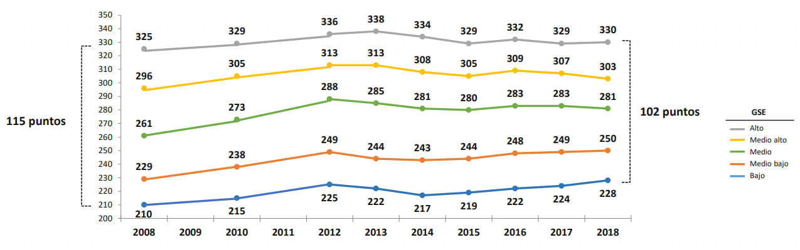
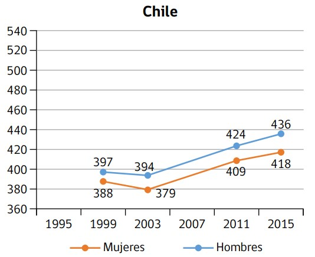

```{r setup, include=FALSE, cache=FALSE}
require("knitr")
options(htmltools.dir.version = FALSE)
pacman::p_load(RefManageR)
knitr::opts_chunk$set(warning=FALSE,
             message=FALSE,
             echo=TRUE,
             cache = TRUE,fig.width=2, fig.height=5.2)
```


```{r, echo=FALSE, results='hide'}
pacman::p_load(dplyr, #Manipulacion de datos
              stargazer, #Tablas
              sjmisc, 
              summarytools, 
              kableExtra, 
              sjPlot, 
              corrplot, 
              sessioninfo,
              webshot, 
              lme4,
              reghelper,
              haven,
              descr,
              ggplot2, 
              texreg,
              lm.beta,
              sjlabelled,
              install = FALSE) 
```


```{r xaringanExtra-scribble, echo=FALSE}
xaringanExtra::use_scribble()
```

class: inverse middle center

# **Composición social de las escuelas y rendimiento académico** 

.class-info[
*Defensa de tesis para optar al grado de Sociólogo*
]

Carlos Budnevich Portales 

</br>


Profesor guía: Dr. Juan Carlos Castillo

Comisión: Dra. Lorena Ortega y Dra. (c) Andrea Greibe

Facultad de Ciencias Sociales, Universidad de Chile

Junio 2021

---

#Programa de hoy

- ¿Por qué estudiar la composición escolar?

- Problema de investigación

- Pregunta de investigación

- Revisión de literatura

- Hipótesis de investigación

--

- Datos, variables, método

- Análisis descriptivo

- Modelos 

--

- Discusión de resultados

- Conclusión

---

class: roja middle center 

# 1.- ¿Por qué estudiar la composición escolar?

---

# ¿Por qué estudiar la composición escolar?

- Razones personales en relación con las caracteristicas socioeconomicas y culturales del colegio en el que estudié

- Chile como país muy segregado a todo nivel, incluyendo su sistema educacional
 

</br>

- La educación como mecanismo de cohesión social

</br>

- Estudiantes desaventajad_s son especialmente sensibles a la composición

---
class: inverse center middle

#  ¿En qué medida la heterogeneidad de la composición escolar, en términos socioeconómicos, de género, étnicos, y nacionalidad, se relaciona con los resultados obtenidos por mujeres, indígenas, migrantes, e individuos de bajo nivel socioeconómico en la prueba SIMCE 2017 de matemática y lenguaje?


---
# Estratificación socioeconómica 

  **Gráfico 1: Estratificación del rendimiento académico**

.small[        Fuente: Informe MINEDUC 2018
] 


---
# Brechas de género

.pull-left[

.small[Fuente: Informe Agencia de calidad de la&nbsp;Educación 2015
]
]

.pull-right[
.very-big[
- Diferencias persistentes en el tiempo

- Tanto hombres como mujeres han mejorado sistematicamente su rendimiento

- Cabe preguntar por las razones detrás de esta amplia brecha
]
]
---
# Hipótesis de investigación 

(1) Los alumnos de niveles socioeconómicos más bajos se ven más favorecidos de establecimientos heterogéneos socioeconómicamente que aquellos alumnos de niveles socioeconómicos más altos


(2) Las mujeres se ven beneficiadas en términos del rendimiento que tienen en matemática cuando se encuentran en colegios no mixtos, mientras en lenguaje no hay un efecto significativo de una composición de estas características

(3) Los indígenas y migrantes obtienen mejores resultados cuando se encuentran mezclados con individuos de origen étnico y nacionalidad diverso que cuando están homogéneamente concentrados
---

# Datos y variables
.tiny[
|Variable| Descripción | Categorías de respuesta | Fuente de información |
|----------|---------|--------|---------|
|           |**Variable&nbsp;dependiente**| | | 
| Prueba SIMCE| Puntaje SIMCE Mat. y Leng.  | 100-400 ptos. | Simce (2017)|
|           |**Variables&nbsp;independientes L1**| | | |
| Ingresos del hogar per cápita | Ingresos líquidos mensuales/miembros del hogar| Desde $5 mil hasta 1,5 mill. | Simce (2017)|
|Sexo| Sexo del estudiante|  1:Mujer </br> 0: Hombre| Simce (2017)| 
|Etnia| Origen étnico del estudiante/familia| 1:Indígena  </br> 0: No indígena| Simce (2017)|
|Nacionalidad| Nacionalidad del estudiante/familia| 1: Migrante  </br> 0: No migrante| Simce (2017)|
|           |**Variables&nbsp;independientes L2**| | | |
| Heterogeneidad socioeconómica| Desviación estandar de ingresos II medio| Desde $8.333 a $822.268| Simce (2017)|
| Composición de género| Perfiles de establecimiento según método de Jenks| Alta homogeneidad  </br> Heterogeneidad  </br> Baja homogeneidad| Simce (2017)| 
| Composición étnica| Perfiles de establecimientos según método de Jenks| Alta homogeneidad  </br> Heterogeneidad  </br> Baja homogeneidad| Simce (2017)| 
| Composición migratoria| Perfiles de establecimientos según método de Jenks| Alta homogeneidad  </br> Heterogeneidad  </br> Baja homogeneidad| Simce (2017)| 
]
---
# Analisis descriptivo 
```{r, echo=FALSE, results='hide'}
load("input/data/proc/data.RData")
load("input/data/proc/data_agg.RData")


```

.pull-left[
.tiny[
```{r, echo=FALSE, results='asis', message=FALSE}
stargazer(data, type="html", digits = 3, header= FALSE, title="Tabla 1: Descriptivos nivel estudiante", summary.stat=c("n", "mean", "sd", "median", "min", "max"))


```
]
]


```{r, echo=FALSE, results='hide', warning=FALSE}

data_agg_d= data %>% group_by(rbd) %>% summarise_all(funs(mean)) %>% as.data.frame()

```


.pull-right[
.tiny[
```{r, echo=FALSE, results='asis', message=FALSE}
stargazer(data_agg_d, title= "Tabla 4: Descriptivos de establecimientos", type="html", header=FALSE, summary.stat=c("n", "mean", "sd", "median", "min", "max"))
```
]
]

---
# Distribución de tipos de establecimientos

```{r, echo=FALSE, results='hide'}

##dividimos para escalamiento de variables
data_agg$m_ingresos= (data_agg$m_ingresos)/10000
data_agg$sd_ingresos=(data_agg$sd_ingresos)/10000


data_agg= round(data_agg, digits = 2)

##agregamos variables indepe de perfiles de establecimientos

data_agg$sexo_j = ifelse(data_agg$num_mujeres<=0.39, "homogeneo bajo", ifelse((data_agg$num_mujeres>0.39) & (data_agg$num_mujeres<=0.72), "heterogeneo", "homogeneo alto")) 

data_agg$sexo_j= as_factor(data_agg$sexo_j)

data_agg$cultura_j = ifelse(data_agg$div_cultura<=0.19, "homogeneo bajo", ifelse((data_agg$div_cultura>0.20) & (data_agg$div_cultura<=0.44), "heterogeneo", "homogeneo alto")) 

data_agg$cultura_j= as_factor(data_agg$cultura_j)

data_agg$nacionalidad_j = ifelse(data_agg$p_nacionalidad<0.07, "homogeneo bajo", ifelse((data_agg$p_nacionalidad>=0.07) & (data_agg$p_nacionalidad<=0.23), "heterogeneo", "homogeneo alto")) 

data_agg$nacionalidad_j= as_factor(data_agg$nacionalidad_j)

data_agg$etnia_j = ifelse(data_agg$p_etnia<=0.16, "homogeneo bajo", ifelse((data_agg$p_etnia>0.16) & (data_agg$p_etnia<=0.41), "heterogeneo", "homogeneo alto")) 

data_agg$etnia_j= as_factor(data_agg$etnia_j)

##creamos en otra base de datos las composiciones para que aparezca n de colegios
data_agg_d$sexo_j = ifelse(data_agg_d$sexo<=0.39, "Homogéneo bajo", ifelse((data_agg_d$sexo>0.39) & (data_agg_d$sexo<=0.72), "Heterogéneo", "Homogéneo alto")) 

data_agg_d$nacionalidad_j = ifelse(data_agg_d$nacionalidad<0.07, "Homogéneo bajo", ifelse((data_agg_d$nacionalidad>=0.07) & (data_agg_d$nacionalidad<=0.23), "Heterogéneo", "Homogéneo alto")) 

data_agg_d$etnia_j = ifelse(data_agg_d$etnia<=0.16, "Homogéneo bajo", ifelse((data_agg_d$etnia>0.16) & (data_agg_d$etnia<=0.41), "Heterogéneo", "Homogéneo alto")) 

data_agg_d$etnia_j= as_factor(data_agg_d$etnia_j)

data_agg_d$nacionalidad_j= as_factor(data_agg_d$nacionalidad_j)

data_agg_d$sexo_j= as_factor(data_agg_d$sexo_j)

```

.pull-left[
.tiny[
```{r, echo=FALSE, results='asis', fig.height=6, fig.width=6}

plot_frq(data=data_agg_d$sexo_j, title="Gráfico 10: Distribución colegios según composición de género", axis.title = "Tipo de establecimiento")

```

Fuente: Elaboración propia en base a datos SIMCE 2017
]
]


.pull-right[
.tiny[
```{r, echo=FALSE, results='asis', fig.height=6, fig.width=6}

plot_frq(data=data_agg_d$nacionalidad_j, title="Gráfico 12: Distribución colegios según composición migratoria", axis.title = "Tipo de establecimiento")
```

Fuente: Elaboración propia en base a datos SIMCE 2017 
]
]
---
#Distribución de tipos de establecimientos

.pull-left[
.tiny[
```{r, echo=FALSE, results='asis', fig.height=7, fig.width=6}

plot_frq(data=data_agg_d$etnia_j, title="Gráfico 11: Distribución colegios según composición étnica", axis.title = "Tipo de establecimiento")
```

Fuente: Elaboración propia en base a datos SIMCE 2017
]
]

.pull-right[
- Se puede apreciar de forma más precisa la composición de los establecimientos según las diferentes variables consideradas 

- Por una parte, es posible advertir una clara mixtura en lo que refiere a la composición de género de los colegios

- Por otra, en el caso de migrante e indigenas es más bien poco frecuente una mayor mixtura e interacción cultural/étnica

]

---


```{r, echo=FALSE, results='hide', fig.height=4, fig.width=6}
colegios<-read_dta("input/data/original/simce2m2017_rbd_publica_final.dta")

colegios= colegios %>% select(rbd, cod_depe2)
  ##para incluir variable dependencia adminsitrativo en modelos

data_agg= merge(data_agg, colegios, by="rbd")

mean(data_agg$educacion)

##centramos a la gran media la variable promedio educacion del establecimiento

data_agg$m_educacion_c= data_agg$m_educacion - 12.23

data_agg$cod_depe2=as_factor(data_agg$cod_depe2)

##modelo individual, grupal, y multinivel para matematica
##individual
results_1 = lmer(puntaje_mate ~ 1 + log(ingresos) + sexo + educacion + nacionalidad + etnia + (1|rbd), data = data)


## grupal
results_2= lmer(puntaje_mate ~ 1 + m_ingresos + sd_educacion + sd_ingresos + m_educacion_c + nacionalidad_j + etnia_j + sexo_j + (1|rbd), data=data_agg)


##multinivel
results_3 = lmer(puntaje_mate ~ 1 + log(ingresos) + sexo + educacion + nacionalidad + etnia + sd_ingresos + m_educacion_c + sd_educacion + m_ingresos + nacionalidad_j + etnia_j + sexo_j + (1|rbd), data = data_agg)

screenreg(list(results_1, results_2, results_3))  

```


.tiny[
```{r, echo=FALSE, results='asis'}
##tabla matematica

htmlreg(list(results_1, results_2, results_3),
    custom.model.names = c("Individual","Grupal","Multinivel"),
    custom.coef.names = c("Intercepto", "Ingresos" ,"Mujer", "Educación", "Migrante", "Indígena", "Promedio ingresos", "Heterogeneidad educativa", "Heterogeneidad social", "Promedio nivel educativo", "Homogeneidad migratoria alta", "Homogeneidad migratoria baja", "Homogeneidad étnica alta", "Homogeneidad étnica baja", "Alta homogeneidad género", "Baja homogeneidad género"),
    custom.note = "%stars. Errores estándar en paréntesis",
    caption="Comparación modelos SIMCE Matemática",
    caption.above=TRUE,
    digits=2,
    doctype = FALSE,
    single.row=TRUE)

```
]


```{r, echo=FALSE, results='hide'}

##modelo individual, grupal, y multinivel para lenguaje
##individual
results_4 = lmer(puntaje_leng ~ 1 + log(ingresos) + sexo + educacion + nacionalidad + etnia + (1|rbd), data = data)


## grupal
results_5= lmer(puntaje_leng ~ 1 + m_ingresos + sd_educacion + sd_ingresos + m_educacion_c + nacionalidad_j + etnia_j + sexo_j + cod_depe2 + (1|rbd), data=data_agg)


##multinivel
results_6 = lmer(puntaje_leng ~ 1 + log(ingresos) + sexo + educacion + nacionalidad + etnia + sd_ingresos + m_educacion_c + sd_educacion + m_ingresos + nacionalidad_j + etnia_j + sexo_j + cod_depe2 + (1|rbd), data = data_agg)

screenreg(list(results_4, results_5, results_6))


```


```{r, echo=FALSE, results='hide'}
##tabla lenguaje 

htmlreg(list(results_4, results_5, results_6),
    custom.model.names = c("Individual","Grupal","Multinivel"),
    custom.coef.names = c("Intercepto", "Ingresos" ,"Mujer", "Educación", "Migrante", "Indígena", "Promedio ingresos", "Heterogeneidad educativa", "Heterogeneidad social", "Promedio nivel educativo", "Homogeneidad migratoria alta", "Homogeneidad migratoria baja", "Homogeneidad étnica alta", "Homogeneidad étnica baja", "Alta homogeneidad género", "Baja homogeneidad género", "Particular Subvencionado", "Particular Pagado" ),
    custom.note = "%stars. Errores estándar en paréntesis",
    caption="Comparación modelos SIMCE Lenguaje",
    caption.above=TRUE,
    digits=2,
    doctype = FALSE,
    single.row=TRUE)


```
]
]
---

# Discusión de los resultados

---

# Conclusiones 

---

class: inverse middle center

# **Composición social de las escuelas y rendimiento académico** 

.class-info[
*Defensa de tesis para optar al grado de Sociólogo*
]

Carlos Budnevich Portales 

</br>


Profesor guía: Dr. Juan Carlos Castillo

Comisión: Dra. Lorena Ortega y Dra. (c) Andrea Greibe

Facultad de Ciencias Sociales, Universidad de Chile

Junio 2021