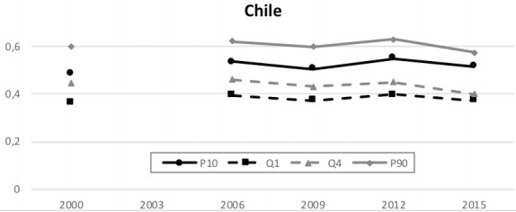
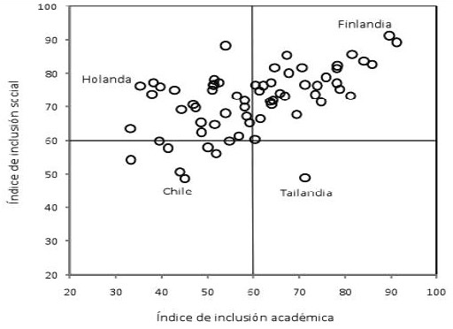

```{r setup, include=FALSE, cache=FALSE}
require("knitr")
options(htmltools.dir.version = FALSE)
pacman::p_load(RefManageR)
knitr::opts_chunk$set(warning=FALSE,
             message=FALSE,
             echo=TRUE,
             cache = TRUE,fig.width=2, fig.height=5.2)
```


```{r, echo=FALSE, results='hide'}
pacman::p_load(dplyr, #Manipulacion de datos
              stargazer, #Tablas
              sjmisc, 
              summarytools, 
              kableExtra, 
              sjPlot, 
              corrplot, 
              sessioninfo,
              webshot, 
              lme4,
              reghelper,
              haven,
              descr,
              ggplot2, 
              texreg,
              lm.beta,
              sjlabelled,
              install = FALSE) 
```


```{r xaringanExtra-scribble, echo=FALSE}
xaringanExtra::use_scribble()
```

class: inverse middle center

# **Composición social de las escuelas y rendimiento académico** 

.class-info[
*Defensa de tesis para optar al grado de Sociólogo*
]

Carlos Budnevich Portales 

</br>


Profesor guía: Dr. Juan Carlos Castillo

Comisión: Dra. Lorena Ortega y Dra. (c) Andrea Greibe

Facultad de Ciencias Sociales, Universidad de Chile

Junio 2021

---

#Programa de hoy

- ¿Por qué estudiar la composición escolar?

- Problema de investigación

- Pregunta de investigación

- Revisión de literatura

- Hipótesis de investigación

- Datos, variables, método

- Análisis descriptivo

- Gráficos bivariados

- Modelos 

- Discusión de resultados

- Conclusión

- Comentarios comisión

---

class: roja middle center 

# ¿Por qué estudiar la composición escolar?

---

# ¿Por qué estudiar la composición escolar?


- Chile como caso particular de estudio debido a su sistema educacional muy segregado (Bellei, 2007, 2013; Bellei, 2015; Contreras et al., 2010; Garcia-Huidobro, 2007; Treviño et al., 2014; Valenzuela et al., 2008)
 

</br>

- La importancia de una educación más igualitaria e inclusiva (Valenzuela et al., 2008; Villalobos et al., 2020; van de Werfhorst, 2014)

</br>

- Contexto de grandes transformaciones estructurales del sistema educativo: Sistema de admisión escolar (SAE) y ley de Nueva Educación Pública (Carrasco & Flores, 2019; Bellei et al., 2018)


---
# Desigualdades académicas 

  **Gráfico 1: Estratificación del rendimiento académico**

.small[        Fuente: Informe MINEDUC 2018
] 


---
# Brechas de género

.pull-left[
**Gráfico 2: Brechas de género prueba TIMSS matemática**

.small[Fuente: Informe Agencia de calidad de la&nbsp;Educación 2015
]
]

.pull-right[
.very-big[
- Tanto hombres como mujeres han mejorado sistematicamente su rendimiento

- Diferencias persistentes en el tiempo

- Cabe preguntar por las razones detrás de esta amplia brecha
]
]
---
# Nuestro sistema educacional

.pull-left[

**Gráfico 3: Segregación socioeconómica por ingreso**


Fuente: Extraído de Murillo et. al (2018)
]

--

.pull-right[

**Gráfico 4: Inclusión social de países OCDE**

Fuente: Extraído de Bellei (2013)

]

---
class: inverse center middle

#  ¿En qué medida la heterogeneidad de la composición escolar, en términos socioeconómicos, de género, étnicos, y nacionalidad, se relaciona con los resultados obtenidos por mujeres, indígenas, migrantes, e individuos de bajo nivel socioeconómico en la prueba SIMCE 2017 de matemática y lenguaje?

---
# Revisión de literatura 

- Según las investigaciones en nuestro país la heterogeneidad socioeconómica tendría un efecto positivo en el rendimiento (Mizala & Torche, 2012; Valenzuela et al.,
2008; Taut & Escobar, 2012; Ortiz, 2015), conclusiones algo diferentes en la experiencia internacional  (Nash & Harker, 1997; Nash, 2003; Sammons et al., 1997)

--

- No son unívocos los resultados de investigaciones acerca de cómo influye el ordenamiento de género de los establecimientos. Algunos estudios muestran lo beneficioso de la mixtura (Hoxby, 2000) y otros descartan este efecto (Paredes, 2018; Bertrand, 2011; Dumay & Dupriez, 2008)

--

- En general, se ha documentado amplias diferencias academicas entre poblacion mapuche y no mapuche, donde podemos mencionar investigaciones como la de Undurraga (2014), Cerda (2009), McEwan (2004), y Canales & Webb (2018).

--

- En términos de nacionalidad, la evidencia internacional es más bien ambivalente (Driessen (2001); Dronkers & Levels (2007); Szulkin & Jonsson (2007); van Ewijk & Sleegers (2009); Van Houtte & Stevens (2010); Agirdag et al. (2012) y la nacional no se ha ocupado directamente de la composición migratoria de las escuelas y rendimiento pero sí de otros elementos (Ortega et al., 2020)

---
# Hipótesis de investigación 

(1) Los alumnos de niveles socioeconómicos más bajos se ven más favorecidos de establecimientos heterogéneos socioeconómicamente que aquellos alumnos de niveles socioeconómicos más altos

--

(2) Las mujeres se ven beneficiadas en términos del rendimiento que tienen en matemática cuando se encuentran en colegios no mixtos, mientras en lenguaje no hay un efecto significativo de una composición de estas características

--

(3) Los indígenas y migrantes obtienen mejores resultados cuando se encuentran mezclados con individuos de origen étnico y nacionalidad diverso que cuando están homogéneamente concentrados

---

# Datos y variables
.tiny[
|Variable| Descripción | Categorías de respuesta | Fuente de información |
|----------|---------|--------|---------|
|           |**Variable&nbsp;dependiente**| | | 
| Prueba SIMCE| Puntaje SIMCE Mat. y Leng.  | 100-400 ptos. | Simce (2017)|
|           |**Variables&nbsp;independientes L1**| | | |
| Ingresos del hogar per cápita | Ingresos líquidos mensuales/miembros del hogar| Desde $5 mil hasta 1,5 mill. | Simce (2017)|
|Sexo| Sexo del estudiante|  1:Mujer </br> 0: Hombre| Simce (2017)| 
|Etnia| Origen étnico del estudiante/familia| 1:Indígena  </br> 0: No indígena| Simce (2017)|
|Nacionalidad| Nacionalidad del estudiante/familia| 1: Migrante  </br> 0: No migrante| Simce (2017)|
|           |**Variables&nbsp;independientes L2**| | | |
| Heterogeneidad socioeconómica| Desviación estandar de ingresos II medio| Desde $8.333 a $822.268| Simce (2017)|
| Composición de género| Perfiles de establecimiento según método de Jenks| Alta homogeneidad  </br> Heterogeneidad  </br> Baja homogeneidad| Simce (2017)| 
| Composición étnica| Perfiles de establecimientos según método de Jenks| Alta homogeneidad  </br> Heterogeneidad  </br> Baja homogeneidad| Simce (2017)| 
| Composición migratoria| Perfiles de establecimientos según método de Jenks| Alta homogeneidad  </br> Heterogeneidad  </br> Baja homogeneidad| Simce (2017)| 
]


---
# Analisis descriptivo 
```{r, echo=FALSE, results='hide'}
load("input/data/proc/data.RData")
load("input/data/proc/data_agg.RData")


```

.pull-left[
.tiny[
```{r, echo=FALSE, results='asis', message=FALSE}
stargazer(data, type="html", digits = 3, header= FALSE, title="Tabla 2: Descriptivos nivel estudiante", summary.stat=c("n", "mean", "sd", "median", "min", "max"))


```
Fuente: Elaboración propia en base a datos SIMCE 2017
]
]


```{r, echo=FALSE, results='hide', warning=FALSE}

data_agg_d= data %>% group_by(rbd) %>% summarise_all(funs(mean)) %>% as.data.frame()

```


.pull-right[
.tiny[
```{r, echo=FALSE, results='asis', message=FALSE}
stargazer(data_agg_d, title= "Tabla 3: Descriptivos de establecimientos", type="html", header=FALSE, summary.stat=c("n", "mean", "sd", "median", "min", "max"))
```
Fuente: Elaboración propia en base a datos SIMCE 2017
]
]

---
# Distribución de tipos de establecimientos

```{r, echo=FALSE, results='hide'}


##creamos en otra base de datos las composiciones para que aparezca n de colegios
data_agg_d$sexo_j = ifelse(data_agg_d$sexo<=0.39, "Homogéneo bajo", ifelse((data_agg_d$sexo>0.39) & (data_agg_d$sexo<=0.72), "Heterogéneo", "Homogéneo alto")) 

data_agg_d$nacionalidad_j = ifelse(data_agg_d$nacionalidad<0.07, "Homogéneo bajo", ifelse((data_agg_d$nacionalidad>=0.07) & (data_agg_d$nacionalidad<=0.23), "Heterogéneo", "Homogéneo alto")) 

data_agg_d$etnia_j = ifelse(data_agg_d$etnia<=0.16, "Homogéneo bajo", ifelse((data_agg_d$etnia>0.16) & (data_agg_d$etnia<=0.41), "Heterogéneo", "Homogéneo alto")) 

data_agg_d$etnia_j= as_factor(data_agg_d$etnia_j)

data_agg_d$nacionalidad_j= as_factor(data_agg_d$nacionalidad_j)

data_agg_d$sexo_j= as_factor(data_agg_d$sexo_j)

```

.pull-left[
.tiny[
```{r, echo=FALSE, results='asis', fig.height=6, fig.width=6}

plot_frq(data=data_agg_d$sexo_j, title="Gráfico 5: Distribución colegios según composición de género", axis.title = "Tipo de establecimiento")

```

Fuente: Elaboración propia en base a datos SIMCE 2017
]
]


.pull-right[
.tiny[
```{r, echo=FALSE, results='asis', fig.height=6, fig.width=6}

plot_frq(data=data_agg_d$nacionalidad_j, title="Gráfico 6: Distribución colegios según composición migratoria", axis.title = "Tipo de establecimiento")
```

Fuente: Elaboración propia en base a datos SIMCE 2017 
]
]
---
#Distribución de tipos de establecimientos

.pull-left[
.tiny[
```{r, echo=FALSE, results='asis', fig.height=7, fig.width=6}

plot_frq(data=data_agg_d$etnia_j, title="Gráfico 7: Distribución colegios según composición étnica", axis.title = "Tipo de establecimiento")
```

Fuente: Elaboración propia en base a datos SIMCE 2017
]
]

.pull-right[
- Se puede apreciar de forma más precisa la composición de los establecimientos según las diferentes variables consideradas 

- Por una parte, es posible advertir una clara mixtura en lo que refiere a la composición de género de los colegios

- Por otra, en el caso de migrante e indigenas es más bien poco frecuente una mayor mixtura e interacción cultural/étnica

]

---
# Gráficos bivariados 

.pull-left[
.tiny[
**Gráfico 8: Puntaje SIMCE colegios según promedio educacional**

```{r, echo=FALSE, results='asis', fig.height=6, fig.width=7}
options(scipen=999)

plot_scatter(data_agg_d, educacion, puntaje_mate)


```

Fuente: Elaboración propia en base a datos SIMCE 2017

]
]

.pull-right[
.tiny[

**Gráfico 9: Puntaje SIMCE colegios según promedio de ingresos** 

```{r, echo=FALSE, results='asis', fig.height=6, fig.width=7}
plot_scatter(data_agg_d, ingresos, puntaje_mate)
```

Fuente: Elaboración propia en base a datos SIMCE 2017

]
]

---
class: roja middle center 

# Modelos

---

```{r, echo=FALSE, results='hide', fig.height=4, fig.width=6}
##dividimos para escalamiento de variables
data_agg$m_ingresos= (data_agg$m_ingresos)/10000
data_agg$sd_ingresos=(data_agg$sd_ingresos)/10000


data_agg= round(data_agg, digits = 2)

##agregamos variables indepe de perfiles de establecimientos

data_agg$sexo_j = ifelse(data_agg$num_mujeres<=0.39, "homogeneo bajo", ifelse((data_agg$num_mujeres>0.39) & (data_agg$num_mujeres<=0.72), "heterogeneo", "homogeneo alto")) 

data_agg$sexo_j= as_factor(data_agg$sexo_j)

data_agg$cultura_j = ifelse(data_agg$div_cultura<=0.19, "homogeneo bajo", ifelse((data_agg$div_cultura>0.20) & (data_agg$div_cultura<=0.44), "heterogeneo", "homogeneo alto")) 

data_agg$cultura_j= as_factor(data_agg$cultura_j)

data_agg$nacionalidad_j = ifelse(data_agg$p_nacionalidad<0.07, "homogeneo bajo", ifelse((data_agg$p_nacionalidad>=0.07) & (data_agg$p_nacionalidad<=0.23), "heterogeneo", "homogeneo alto")) 

data_agg$nacionalidad_j= as_factor(data_agg$nacionalidad_j)

data_agg$etnia_j = ifelse(data_agg$p_etnia<=0.16, "homogeneo bajo", ifelse((data_agg$p_etnia>0.16) & (data_agg$p_etnia<=0.41), "heterogeneo", "homogeneo alto")) 

data_agg$etnia_j= as_factor(data_agg$etnia_j)

##agregamos dep adminsitrativa

colegios<-read_dta("input/data/original/simce2m2017_rbd_publica_final.dta")

colegios= colegios %>% select(rbd, cod_depe2)

data_agg= merge(data_agg, colegios, by="rbd")

##centrado
data_agg$m_educacion_c= data_agg$m_educacion - 12.23
## dependencia adm como factor
data_agg$cod_depe2=as_factor(data_agg$cod_depe2)

##modelo individual, grupal, y multinivel para matematica
##individual
results_1 = lmer(puntaje_mate ~ 1 + log(ingresos) + sexo + educacion + nacionalidad + etnia + (1|rbd), data = data)


## grupal
results_2= lmer(puntaje_mate ~ 1 + m_ingresos + sd_educacion + sd_ingresos + m_educacion_c + nacionalidad_j + etnia_j + sexo_j + cod_depe2 + (1|rbd), data=data_agg)

screenreg(results_2)

##multinivel
results_3 = lmer(puntaje_mate ~ 1 + log(ingresos) + sexo + educacion + nacionalidad + etnia + sd_ingresos + m_educacion_c + sd_educacion + m_ingresos + nacionalidad_j + etnia_j + sexo_j + cod_depe2 + (1|rbd), data = data_agg)

screenreg(list(results_1, results_2, results_3))  


```

.pull-left[
.tiny[
```{r, echo=FALSE, results='asis'}
##tabla matematica

htmlreg(list(results_1, results_3),
    custom.model.names = c("Individual", "Multinivel"),
    custom.coef.names = c("Intercepto", "Ingresos" ,"Mujer", "Educación", "Migrante", "Indígena", "Promedio ingresos", "Heterogeneidad educativa", "Heterogeneidad social", "Promedio nivel educativo", "Homogeneidad migratoria alta", "Homogeneidad migratoria baja", "Homogeneidad étnica alta", "Homogeneidad étnica baja", "Alta homogeneidad género", "Baja homogeneidad género", "Particular subvencionado", "Particular pagado"),
    custom.note = "%stars. Errores estándar en paréntesis",
    caption="Comparación modelos SIMCE Matemática",
    caption.above=TRUE,
    digits=2,
    doctype = FALSE,
    single.row=TRUE,
    include.variance=FALSE,
    include.groups= FALSE, 
    include.nobs= FALSE,
    override.coef= list(c(198.35, 4.05, -5.45, 1.97, 3.04, 0.09, "NA", "NA", "NA", "NA", "NA", "NA", "NA", "NA", "NA", "NA"), 
                        c(179.77, 3.15, -5.67, 1.80, 2.94,  0.33, 0.82, 3.17, -0.42, 15.10, -13.26, 9.29, 7.20, 3.24, 3.16, -10.07, 10.24, -5.60)),
    override.pvalues = list(c(0, 0, 0, 0, 0, 0.5), c(0, 0, 0, 0, 0, 0.5, 0, 0.03, 0.003, 0, 0, 0, 0, 0.003, 0.5, 0, 0, 0.5)))

```
]
]

```{r, echo=FALSE, results='hide'}

##modelo individual, grupal, y multinivel para lenguaje
##individual
results_4 = lmer(puntaje_leng ~ 1 + log(ingresos) + sexo + educacion + nacionalidad + etnia + (1|rbd), data = data)


## grupal
results_5= lmer(puntaje_leng ~ 1 + m_ingresos + sd_educacion + sd_ingresos + m_educacion_c + nacionalidad_j + etnia_j + sexo_j + (1|rbd), data=data_agg)


##multinivel
results_6 = lmer(puntaje_leng ~ 1 + log(ingresos) + sexo + educacion + nacionalidad + etnia + sd_ingresos + m_educacion_c + sd_educacion + m_ingresos + nacionalidad_j + etnia_j + sexo_j + cod_depe2 + (1|rbd), data = data_agg)

screenreg(list(results_4, results_5, results_6))


```
--

.pull-right[
.tiny[
```{r, echo=FALSE, results='asis'}
##tabla lenguaje 

htmlreg(list(results_4, results_6),
    custom.model.names = c("Individual", "Multinivel"),
    custom.coef.names = c("Intercepto", "Ingresos" ,"Mujer", "Educación", "Migrante", "Indígena", "Promedio ingresos", "Heterogeneidad educativa", "Heterogeneidad social", "Promedio nivel educativo", "Homogeneidad migratoria alta", "Homogeneidad migratoria baja", "Homogeneidad étnica alta", "Homogeneidad étnica baja", "Alta homogeneidad género", "Baja homogeneidad género", "Particular subvencionado", "Particular pagado"),
    custom.note = "%stars. Errores estándar en paréntesis",
    caption="Comparación modelos SIMCE Lenguaje",
    caption.above=TRUE,
    digits=2,
    doctype = FALSE,
    single.row=TRUE,
    include.variance=FALSE,
    include.groups= FALSE, 
    include.nobs= FALSE,
    override.coef= list(c(194.43, 2.80, 15.01, 1.58, 1.18, 0.22, "NA", "NA", "NA", "NA", "NA", "NA", "NA", "NA", "NA", "NA"), 
                        c(191.48, 1.85, 14.75, 1.39, 1.18, 0.46, 0.42, 1.80, -0.32, 8.74, -8.03, 7.34, 6.03, 1.52, 2.32, -6.93, 4.30, -5.16)),
     override.pvalues = list(c(0, 0, 0, 0, 0.03, 0.5), c(0, 0, 0, 0, 0.03, 0.5, 0, 0.5, 0.003, 0, 0, 0, 0, 0.5, 0.5, 0, 0, 0.5)))


```
]
]

---
# Gráficos de interacción

--

```{r, echo=FALSE, results='hide'}

##modelos con interacciones para matematica

##interaccion sd ingresos con ser pobre/rico

##creacion variable bajo nse vs otros 

data_agg$quintiles <- dplyr::ntile(x = data_agg$ingresos,
                              n = 5) 
##ahora creamos variable nse con bajo vs el resto, le daremos 1 a nse bajo (que incluye a 2 quintiles mas pobres) y 0 a los no bajos

data_agg$bajo_nse= ifelse(data_agg$quintiles<=2, 0, 1)

##probamos interaccion bajo nse mean ingresos matematica
results_8 = lmer(puntaje_mate ~ 1 + m_ingresos + bajo_nse + m_ingresos*bajo_nse + log(ingresos) + sexo + educacion + nacionalidad + etnia + m_educacion_c + sd_educacion + sd_ingresos + nacionalidad_j + etnia_j + sexo_j + cod_depe2 + (1|rbd), data = data_agg)

screenreg(results_8, naive=TRUE)

##probamos interaccion bajo nse mean ingresos lenguaje
results_9 = lmer(puntaje_leng ~ 1 + m_ingresos + bajo_nse + m_ingresos*bajo_nse + log(ingresos) + sexo + educacion + nacionalidad + etnia + m_educacion_c + sd_educacion + sd_ingresos + nacionalidad_j + etnia_j + sexo_j + cod_depe2 + (1|rbd), data = data_agg)

screenreg(results_9, naive=TRUE)

```

.pull-left[
```{r, echo=FALSE, results='asis', fig.height=8, fig.width=8}
plot_model(results_8, type="int")


```
]

.pull-right[
```{r, echo=FALSE, results='asis', fig.height=8, fig.width=8}
plot_model(results_9, type="int")
```
]
---
# Discusión de los resultados

 - Composición socioeconómica 
 - Composición de género
 - Composición étnica/migrante
 
## Y... la literatura?

 - Cierta inconsistencia con lo hallado por otros autores (Mizala & Torche, 2012; Ortiz, 2015; Taut & Escobar, 2012) pero también quedan preguntas abiertas
 - Por un lado, investigaciones como la de Paredes (2018) muestran beneficios para mujeres de no-mixtura y Villalobos et al. (2016) ausencia de diferencias de rendimiento según tipo de composición
 - En términos étnicos, tenemos resultados diferentes a Canales & Webb (2018) pues colegios heterogéneos siempre serían peores pero similares a evidencia internacional ((Merry & Driessen, 2012; Dronkers & van der Velden, 2013)
 - En relación con composición migratoria se alinea con varios resultados hallados en perspectiva comparada (Szulkin & Jonsson, 2007; Contini, 2013)


---

# Conclusiones 

- Relevancia del estudio de la composición escolar por razones tanto normativas como contextuales

- Una dimensión importante del proceso educativo son las habilidades cognitivas, dentro de muchas otras 

- La relación entre heterogeneidad y rendimiento académico asume sentidos y direcciones diversas

- Recomendaciones de política pública de acuerdo con los resultados obtenidos

- Evidencia internacional como referencia de sistemas educacionales igualitarios y de calidad


---

# Comentarios Prof. Greibe

- Sobre factores que tienen mayor incidencia en la elección de escuela de familias chilenas (Carrasco & Flores, 2019, Canales et al., 2020) 

- Funcionamiento de la segregación según nivel de estratificación del sistema educacional (Dronkers & van der Velden, 2013) 

- Importancia de una educación más igualitaria e inclusiva (Valenzuela et al., 2008; Villalobos et al., 2020; van de Werfhorst, 2014)

---

# Comentarios Prof. Ortega

- No estandarización de los coeficientes por exceder delimitación de la investigación y por tener variables categóricas (Cohen et al., 2020)

- No hay casos influyentes siguiendo el criterio de $4/n$ usando la métrica de distancia de Cook 

- Ajuste comparativo de los modelos  

- Algunos antecedentes sobre la oleada migratoria en Chile y su relación con los hallazgos (INE, 2017)


---
class: inverse middle center

# **Composición social de las escuelas y rendimiento académico** 

.class-info[
*Defensa de tesis para optar al grado de Sociólogo*
]

Carlos Budnevich Portales 

</br>


Profesor guía: Dr. Juan Carlos Castillo

Comisión: Dra. Lorena Ortega y Dra. (c) Andrea Greibe

Facultad de Ciencias Sociales, Universidad de Chile

Junio 2021